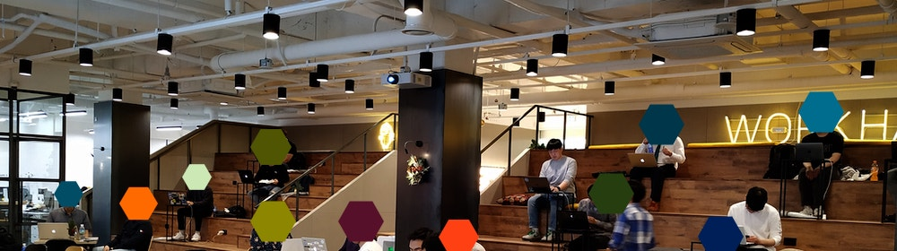
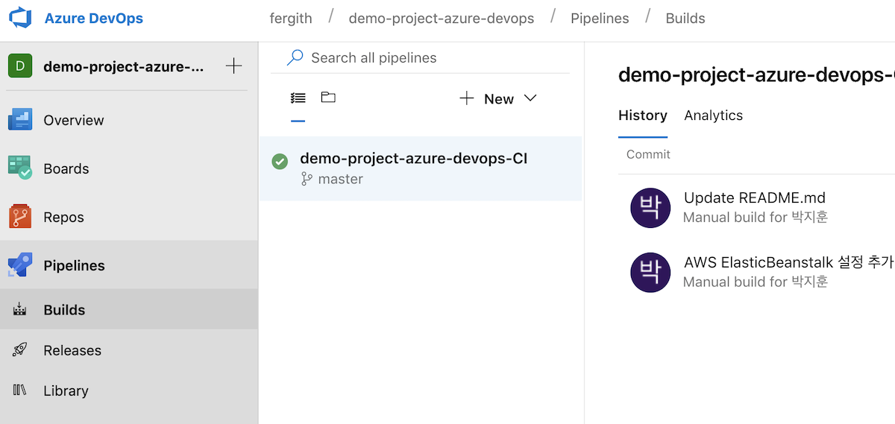
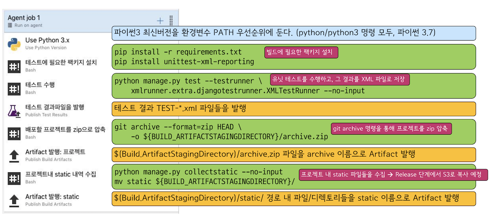
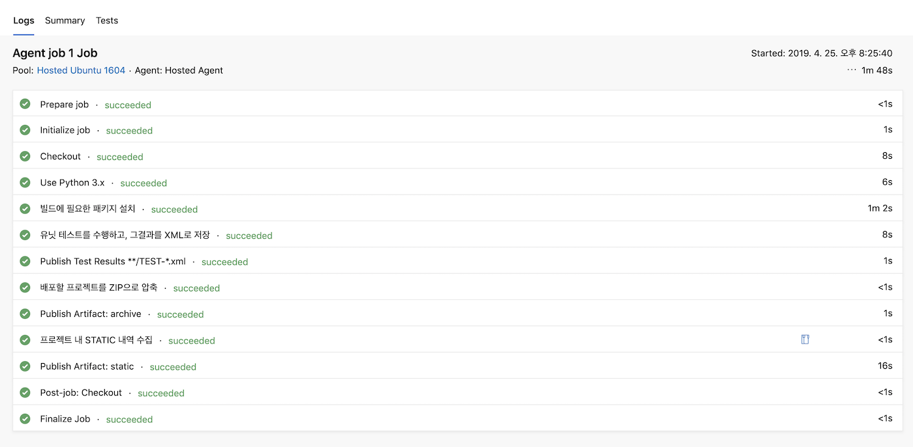
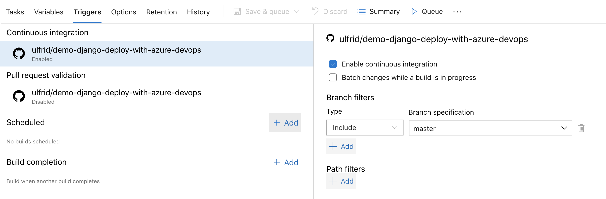
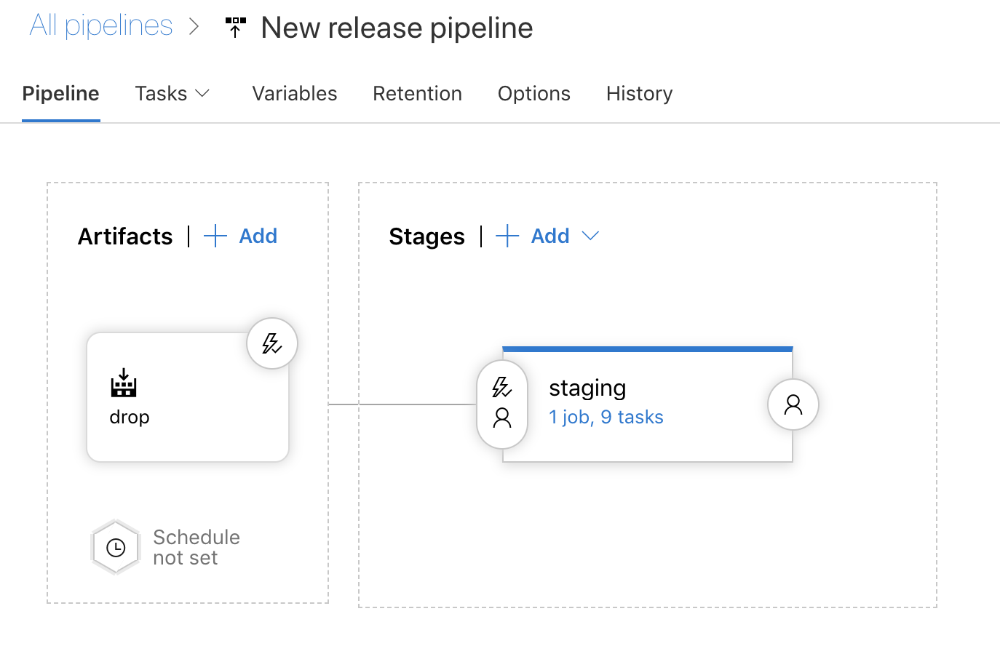
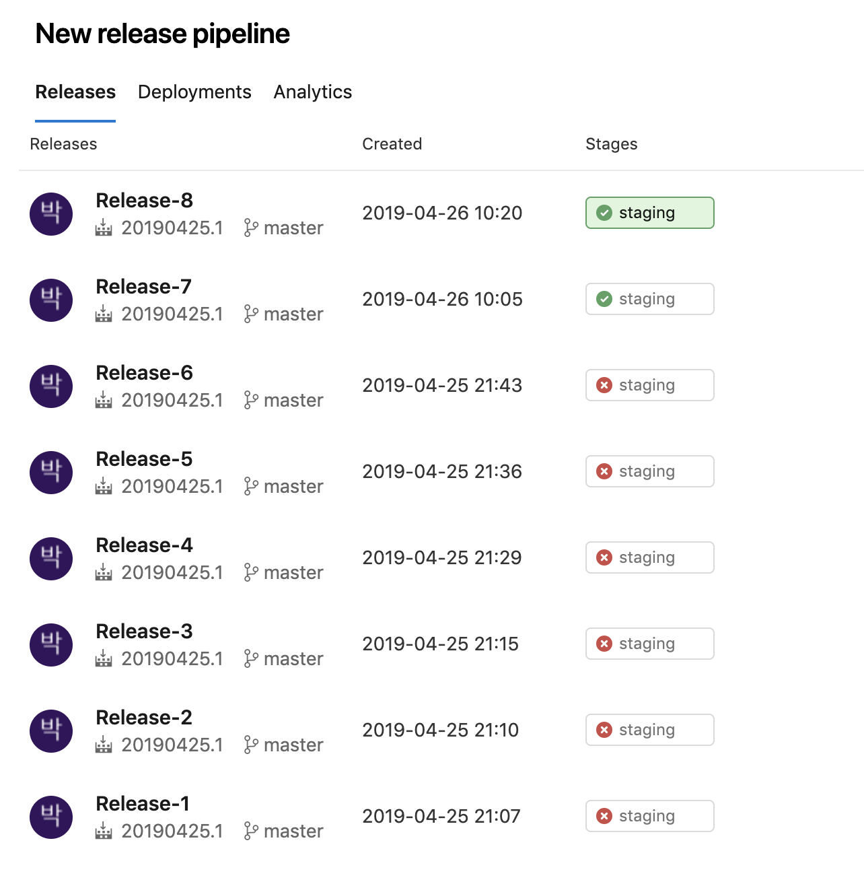
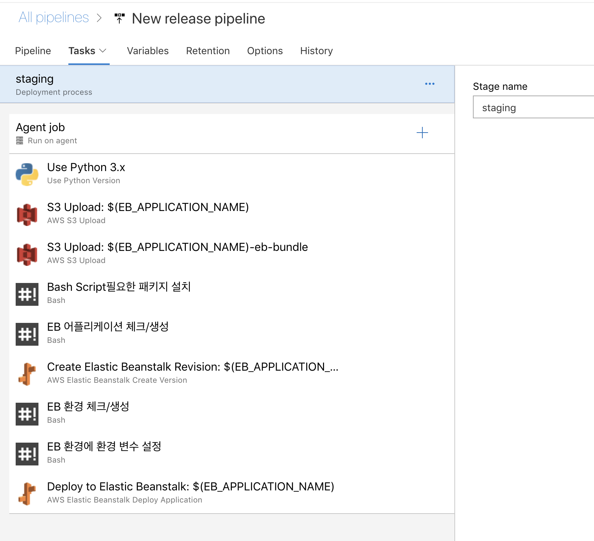
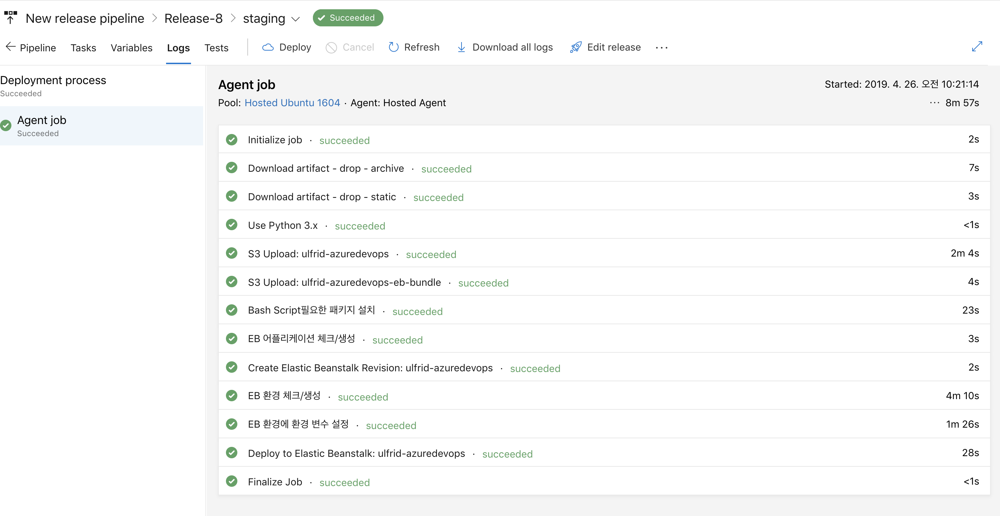

## DevOps Korea 주관 Azure_DevOps 핸즈온랩 참가

- 마이크로 소프트 애저를 접한지는 대략 3년이 넘어가지만, 잘 사용하지 않아 계정이 가물가물 해질쯤 활용도 생기는
  핸즈온랩이 개설되어 참가신청 했다.

- 강의자는 이진석님(https://askcompany.kr) 으로 내가 파이썬을 입문하게 된 계기를 만들어주신 고마운 분이다. 나날이 활동영역이 증가하심에 감탄할뿐.

- 요즘 나는 이직을 고민하며, DevOps 엔지니어로서의 역량 강화에 중점을 두고 있지만, 현실은 너무나 큰 기술 영역에
  어떻게 표준을 잡아야 할 지 고민만 가득하다.

- 요즘의 트렌드 중에 가장 중심에 있는 것은 바로 빠른 빌드와 배포를 통한 무중단 서비스가 핵심인데, 서비스 영역을 잘 구분하는 것도 중요하지만, 그에 걸맞는 기술의 확보 및 최적화 또한 중요하다.

- 어떠한 기술이 뜨겁다고 해서 바로 주류에 편성되는 것도 아니고, 지금 이 쪽 시장에는 다양한 SaaS 및 솔루션 들이 등장하며, 점점 간편화 및 보편화를 향해 가는 듯 보이기도 하다.

- 각설하고, `마이크로소프트에서는 기반 클라우드인 Azure를 통한 DevOps` 서비스를 제공하고 있다. 이를 이용하면, 깃 저장소의 연동 및 아주 간편하게 클릭 한번만으로도 트리거를 설정해서 CI 및 CD를 구축할 수 있도록 제공하고 있다.

- 아마도 AWS, GCP도 비슷한 도구는 존재하고 있겠지만, 아직 다뤄본적이 없어서 비교는 불가했다.

- 일단 `CI / CD 파이프라인`은 일련의 자동화된 과정을 기술하는 것인데, 젠킨스와 도커를 이용해서 진행을 해보는 것이 보통 입문자들이 많이 겪는 코스이다.

- 또한 올바른 빌드 및 릴리즈를 위해, 검증도 거쳐야 하며 보통은 다른 툴을 쓰거나, 직접 설정한 범위의 유닛테스트 등을 진행하는 것이 일반적인 형태이다.

- 본 글에서는 진행에 대한 전부를 기술하려는 것은 아니다. 대략적으로 흐름을 보고 `빌드 파이프라인`과 `배포 파이프라인`에 대해 이해를 높이고 정리해보려고 한다.

- 먼저 처음 실습으로는 배포에 앞서, 빌드를 진행했다.

  1. Azure 아이디가 없다면 가입을 하고 azure devops 서비스로 접근 (https://dev.azure.com)
  2. 조직을 만들고 프로젝트를 생성 후 빌드하고 싶은 저장소를 연결한다.
     
  3. 원하는 환경에 따른 빌드 테스크 항목에 컴포넌트들을 추가해서 수행을 하게된다.
  4. 해당실습은 Python 3.x 최신버전 기준으로 진행됐다.
  5. 먼저 파이썬 버전을 검증하고, 단위 테스트를 위해 툴을 사용한다면 해당 툴을 설치하고, 의존성있는 패키지들을 설치한다.
  6. 유닛테스트를 진행하고, 테스트 통과 후에 결과물은 애저서비스에서 인식할수 있는 방식으로 전달한다.(XML파일)
  7. 빌드된 소스의 배포 경로를 지정하고 배포에 대한 준비를 한다.

- 예시는 아래와 같다.
  
  **출처** 핸즈온랩 자료 핸즈온랩 자료 by 이진석 from https://Askcompany.kr.
  

- CI설정은 트리거에 체크설정 한번만으로 간단히 완료 된다.
  현재 기준은 소스 / 마스터 브랜치에 변동이 있으면 자동으로 체크 후 진행한다.
  

- 성공적으로 빌드 수행을 마치면 이제 이 빌드산출물을 배포할 파이프라인을 구성하게 된다.
  
- 릴리즈 파이프라인 또한 편리하게 구성되어 있다. 이번 릴리즈 배포 대상은 로컬 환경이나 같은 애저 서비스가 아닌, AWS와의 연동으로 작업을 수행하기 전에 IAM을 통해 AWS계정에 별도의 권한을 가진 계정을 생성 후 키와 시크릿을
  이용해 연동해야한다.

- 또한 이 정보들을 별도의 환경변수로 지정하여 사용해야 작업의 흐름이 원할하다.

- 먼저 해볼 작업은 빌드된 산출물을 aws s3버킷을 생성해서 업로드하고, 해당 버킷에서 엘라스틱 빈스토크를 빌드하여, 서비스를 생성한다.

- 이후 서비스가 제대로 올라갔다면, 환경변수를 주입하여 의존성있는 파일들에 대해 정의하고, 서비스를 가동시킨다.

- 실습간에는 위과정에 문제가 발생하였지만, 아마도 AWS 컨디션 문제였던것으로 생각이 든다. 나도 실습 진행간 같은 문제가 발생했었는데

  1. 빈스토크를 실행할 어플리케이션 네임을 강사님의 네임으로 설정해서 유일성이 침해되서 실패.
  2. 기존 이용하던 아마존 계정에 과금을 막겠다고 기본적인 VPC까지 다 날려먹어서 빈스토크가 제대로 구동안되서 실패.
     실패의흔적들
     

- 태스크를 잘 정의하면 다음과 같다.
  

- 잘 진행된 예
  

- 일단 진행된 실습은 여기까지 였다. 이후의 실습 과정은 보완된 별도의 인터넷 강의가 진행되거나, 추가 자료가 제공될 듯 하다.
  간만의 평일 야간 핸즈온랩을 진행하며 피로도도 있었지만, 유익했던 시간이었다. 처음의 막연했던 눈에 그려지지 않던 흐름이 요즘에는 그래도 조금은 그려지는 듯해서 다행이다.
  게으름을 이겨내고 다음에는 자바스크립트 서비스를 간단히 작성해서 비슷한 환경에 빌드 및 배포해보는 실습을 해보고 자세하게 가이드하는 글을 만들어보는 목표를 세워야 겠다. 할일도 많고 자극도 많고, 힘내야 한다.

  좋은 강의를 제공해주신 DevOps Korea 조철현 대표님 및 Ralf 님 그리고 장소 제공해주신 Kmong에 감사드린다.

**강의 자료는 공유가 어려워 추후 변동사항이 있을 경우 등록혹은 링크하겠습니다.**

- 모든 강의 자료 저작권은 이진석 from https://Askcompany.kr 님께 있습니다.
- 기술스택
- Python with django.
- Microsoft Azure DevOps pipeline.
- AWS s3 & Elasticbeanstalk, lambda.
- Github.
