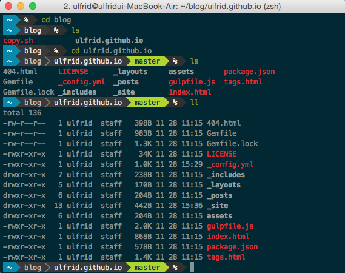

## zsh 테마적용 및 예쁘게 만들기

- 처음 터미널을 접했을때는 별로 할수 있는게 없어서 꾸민다거나, 커스터 마이징이란건 생각도 없었지만, 자주보면 친해진다고 점점 욕심이 생겨서 기왕 쓰는 터미널 예쁘게 쓰자로 생각이 바뀌었다. 개인적으로 쓰는 서버나 맥에서
  설정을 하면 요긴하게 쓸수 있고, 원한다면 putty까지도 zsh셸을 쓰는 환경에 맞춰서 바꿀수 있었다.

- 이미 웹상에 좋은 글들이 많으므로, 그것을 참조하는것도 좋지만 그떄마다 검색하는 것에 한계가 있기에 정리해서 남긴다.

- `oh-my-zsh`를 설치하는 환경은 여러곳이 있겠지만, 우선적으로 개인환경은 맥이 우선이라 일단은 맥 환경에 `iterm` 기반으로 정리하려고 한다.
- 먼저 zsh 및 기타 wget, git 등의 설치 여부를 확인하고

```zsh
    $zsh --verison
    $wget
    $git
```

- 없다면 homebrew를 통한 설치를 한다.

```zsh
    $brew install zsh wget git
```

- 다음은 기본 쉘을 bash에서 zsh로 바꾼다.

```zsh
    $which zsh
     /usr/local/bin/zsh  #경로는 환경에 따라 다를수 있습니다.
    $chsh -s /usr/local/bin/zsh
```

- 기본 쉘 지정이 바뀌었다면 이제 `oh-my-zsh`차례다.

```zsh
    $curl -L https://github.com/robbyrussell/oh-my-zsh/raw/master/tools/install.sh | sh
```

- 먼저 Iterm2의 컬러셋을 변경한다.

- [Iterm2 컬러셋 다운받기](https://github.com/mbadolato/iTerm2-Color-Schemes)에서 다운로드 받으면 다양한 환경용 컬러셋 파일 묶음을 받을수 있다. 이중에 필요한 부분을 사용하면 된다.

- `Iterm2` 실행 후 단축키 `cmd`+`,`을 누르면, preferences 창이 뜨고, profiles -> colors -> load presets의 순으로 선택후 다운받은 컬러셋 파일이 있는 폴더에서 원하는 파일을 선택해서 로드한다.

- 'Solarlized Dark'(보통 기본 튜토리얼은 다들 이걸 쓰시고 마음에 드니까 그냥 사용)을 설치해서 사용한다.

- 그다음으로는 ~/.zshrc 파일의 line number 10쯤에 위치한 ZSH_THEME="agnoster"로 변경한다.

- 그렇게 하면 프롬프트가 멋지게 변하지만 폰트가 깨진다. [폰트 다운받기](https://github.com/powerline/fonts)를 받은뒤 설치해준다.

- 해당폰트는 컬러떄와 마찬가지로 `Iterm2` 실행 후 단축키 `cmd`+`,` profiles -> text
  파워라인도 사용할 예정이라 "12pt Meslo LG M Regular for Powerline"로 선택했다.

- `vim`의 경우 번외라 나중에 따로 정리하도록 하겠다.

- 이어서 `powerline-shell`을 설치해야하는데. `python`이 설치된 환경이라면 `pip`로 설치할 수 있다.

```zsh
    $pip install powerline-shell
    #혹은
    git clone https://github.com/banga/powerline-shell
    cd powerline-shell
    python setup.py install
```

- 설치 후에는 ~/.zshrc 파일에 아래의 내용을 편집기를 이용해 추가해준다.

```zsh
    function powerline_precmd() {
        PS1="$(powerline-shell --shell zsh $?)"
    }

    function install_powerline_precmd() {
    for s in "${precmd_functions[@]}"; do
        if [ "$s" = "powerline_precmd" ]; then
        return
        fi
    done
    precmd_functions+=(powerline_precmd)
    }

    if [ "$TERM" != "linux" ]; then
        install_powerline_precmd
    fi
```

- `powerline-shell --generate-config > ~/.powerline-shell.json`로 설정파일을 생성 후,
  옵션을 지정하면, 프롬프트 표시와 다양한 조건을 표기해준다.

- powerline-shell의 자세한 옵션 및 설치법은 [`powerline-shell`](https://github.com/b-ryan/powerline-shell)에서 확인할 수 있다.

- 현재 지정해서 사용중인 설정

```json
{
  "segments": ["virtual_env", "ssh", "cwd", "git", "hg", "jobs", "root"]
}
```

- 정확히 세팅된다면 아래같은 모습이 된다.

  

**자료 참조 링크**

- 놀부님 블로그 : https://nolboo.kim/blog/2015/08/21/oh-my-zsh/
- 태환님 블로그 : http://thdev.tech/mac/2016/05/01/Mac-ZSH-Install.html
- Item2 컬러셋 깃허브 : https://github.com/mbadolato/iTerm2-Color-Schemes
- 파워라인-쉘 : https://github.com/b-ryan/powerline-shell
- 폰트 셋 : https://github.com/powerline/fonts
- oh-my-zsh : https://github.com/robbyrussell/oh-my-zsh
