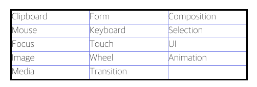
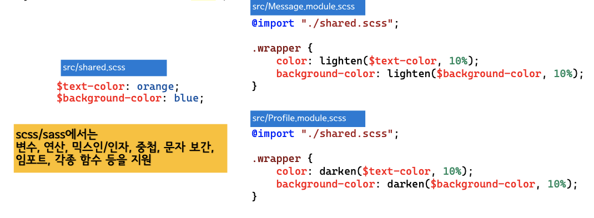
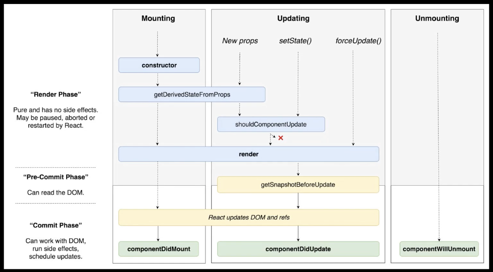

### 리액트를 설치합시다.

리액트는 javascript 기반 SPA(Single Page Application)을 개발할수 있는 프론트엔드 프레임워크 입니다.

리액트 프로젝트를 시작하려면, 먼저 node.js 를 설치합니다. 윈도우, 맥 모두 아래 링크에서 LTS 버전 다운 후 설치!!

[Node.js](https://nodejs.org/ko/)

node를 설치하면,

```bash
node -v
npm -v (node package manager)로 맥의 brew centos의 yum 우분투의 apt와 같은 패키지 인스톨러 입니다. node 설치시 같이 설치됨.
```

yarn 을 쓸것인가 말것인가( facebook에서 npm이 구려서 만든 패키지 인스톨러) 편한대로 하세요.

### CRA? ( Create React App)

말그대로 리액트 앱을 만들어주는 프로그램입니다.

webpack(모듈 및 소스 제어). babel(자바 스크립트 버전제어), es-lint(자바스크립트 문법제어) 와 같은 초기 세팅들을

자동으로 매칭해서 프로젝트를 구성해주는게 바로 CRA 입니다.

```bash
#yarn
yarn create react-app 프로젝트 명
#npm
npx create-react-app 프로젝트 명

두가지 방식이 있습니다. npx는 npm의 개량버전입니다.(별도 설치 없음)
```

```bash
#yarn
yarn start
#npm
npm start
```

-   프로젝트 구조
    
    **1) node.modules**
    
    -   CRA 를 구성하는 모든 패키지 소스 코드가 존재하는 폴더
    
    **2) package.json**
    
    -   CRA 기본 패키지 외 추가로 설치된 라이브러리/패키지 정보(종류, 버전)가 기록되는 파일
    -   모든 프로젝트마다 package.json 하나씩 존재
    -   `"dependencies"`
        -   리액트를 사용하기 위한 모든 패키지 리스트, 버전 확인 가능
            
        -   실제 코드는 `node.modules` 폴더에 존재
            
        -   Why ? node.modules 와 package.json 에서 이중으로 패키지를 관리할까?
            
            -   실제 내가 작성한 코드, 내가 설치한 패키지는 내 로컬에만 존재
            -   github 에 올릴 때 내가 작성한 코드와 함께 `package.json`(추가로 설치한 패키지 정보) 넘긴다.
            -   다른 사람이 그것을 (`pull`) 받아서 `npm install` 만 입력하면 `package.json` 에 기록되어 있는 패키지의 이름과 버전 정보를 확인하여 자동으로 설치한다.
            -   이때, github 에 올릴 때, `node.modules` 는 올리면 안 되는데 (불필요한 용량 차지),
            -   `.gitignore` 파일에 github 에 올리고 싶지 않은 폴더와 파일을 작성할 수 있다.
        -   참고) 새로운 Library(package) 설치 시
            
            -   누군가 만든 소스코드를 다운받는 것
            -   npm으로 설치 (ex. npm install slider)
            -   설치 시 `node modules` 에 자동으로 설치됨.
            -   하지만 `package.json` - `dependencies` 에 추가 자동으로 되는 건 아님.
            -   그래서, `npm install slider —-save`
            -   `—-save` 까지 작성해야 `dependencies` 에 추가됨
            -   (npm 버전이 업그레이드 됨에 따라 자동으로 추가되는 경우가 많지만 여전히 불안한 패키지들이 존재하기 때문에 패키지 설치 시 `—-save` 까지 입력하는 것을 권장합니다.)
    -   `"scripts"`
        -   run : 프로젝트를 development mode(개발 모드) 실행을 위한 명령어. `npm run start`.
            
        -   build : 프로젝트 production mode(배포 모드) 실행을 위한 명령어. 서비스 상용화.
            
    -   참고) [package.json vs. package-lock.json](https://www.youtube.com/watch?v=P2CtFD6xa54)
    
    **3) .gitignore**
    
    -   `.gitignore` 파일에 github 에 올리고 싶지 않은 폴더와 파일을 작성할 수 있다.
    -   `push` 를 해도 `.gitignore` 파일에 작성된 폴더와 파일은 올라가지 않는다.
    
    ### :: **index.html - index.js - App.js**
    
    **1) public - `index.html`**
    
    -   `<div id="root"></div>`
    
    **2) src - `index.js`**
    
    -   React의 시작 (Entry Point)
    -   `ReactDOM.render( <App /> , document.getElementById('root'))`
        -   ReactDOM.render 함수의 인자는 두 개
        -   첫 번째 인자는 화면에 보여주고 싶은 컴포넌트
        -   두 번째 인자는 화면에 보여주고 싶은 컴포넌트의 위치
    -   (이름 함부로 수정하면 안 됨)
    
    **3) src - `App.js`**
    
    -   현재 화면에 보여지고 있는 초기 컴포넌트
    -   Westagram 작업 시 `<Login />` 컴포넌트, `<Main />` 컴포넌트를 그 자리에 대체하여 작업하면 된다.
    -   React Router 를 배운 후에는 `<Routes />` 컴포넌트가 최상위 컴포넌트로 그 자리에 위치하게 된다.
    
    ### :: **기타 폴더 구성**
    
    **1) public 폴더**
    
    -   index.html
    -   images - 이미지 파일 관리
    -   data - mock data 관리 (추후 세션을 통해 다룰 예정)
    
    **2) src 폴더**
    
    -   components - 공통 컴포넌트 관리
    -   pages - 페이지 단위의 컴포넌트 폴더로 구성
        -   Login - `Login.js`, `Login.scss`
        -   Main- `Main.js`, `Main.scss`
    -   styles 폴더
        -   `reset.scss` - css 초기화
        -   `commom.scss` - 공통으로 사용하는 css 속성 정의 (ex. font-family, theme color)
    -   참고) components vs. pages
        -   여러 페이지에서 동시에 사용되는 컴포넌트의 경우 components 폴더에서 관리합니다. (ex. Header, Nav, Footer)
        -   페이지 컴포넌트의 경우 pages 폴더에서 관리합니다.
        -   해당 페이지 내에서만 사용하는 컴포넌트의 경우 해당 페이지 컴포넌트 폴더 하위에서 관리합니다.
-   Component
    
    ### 컴포넌트의 정의
    
    -   component : 재활용 가능한 UI 구성 단위
        
    -   ex. instagram 메인 페이지
        
        -   예를 들어, instagram main 페이지를 Component로 나눈다면,
        -   크게 Nav 컴포넌트와 Main 컴포넌트, 그리고 Main 컴포넌트 안에는 Feed 컴포넌트와 MainRight 컴포넌트로 나눌 수 있습니다.
        -   이와 같이 화면의 구성 요소들을 컴포넌트로 나눌 수 있습니다.
        
        
        
        ### **컴포넌트의 특징**
        
        -   재활용하여 사용할 수 있다.
        -   코드 유지보수에 좋다.
        -   해당 페이지가 어떻게 구성되어 있는지 한 눈에 파악하기 좋다.
        -   컴포넌트는 또 다른 컴포넌트를 포함할 수 있다. (부모 컴포넌트 - 자식 컴포넌트)
    
    ## Class vs. Functional Component
    
    컴포넌트의 종류, 즉 컴포넌트를 선언하는 방식에는 두 가지가 있습니다.
    
    -   Class형 컴포넌트(Class Component)
    -   함수형 컴포넌트(Functional Component)
    
    **1) Class Component**
    
    ```jsx
    import React from 'react'
    
    class Component extends React.Component {
      render() {
        return (
    			<div>
    				<h1>This is Class Component!</h1>
    			</div>
    		)
      }
    }
    
    export default Component
    ```
    
    -   클래스형 컴포넌트에서는 위와같이 `render` 함수가 꼭 있어야 하고, 그 안에 보여 주어야 할 JSX를 반환합니다.
    
    **2) Functional Component**
    
    ```jsx
    import React from 'react'
    
    const Component = () => {
      return (
    			<div>
    				<h1>This is Functional Component!</h1>
    			</div>
    		)
    };
    
    export default Component
    ```
    
    -   함수형 컴포넌트가 보기에는 훨씬 간단하고 작성하기 편리한 장점이 있습니다.
    -   하지만 처음 리액트를 배우는 단계에서는 class형 컴포넌트로 학습하는 것을 추천합니다.
    -   lifecylce, state, props 등 주요 개념들을 익히기에는 class형 컴포넌트가 훨씬 직관적이고 배우기 쉽기 때문입니다. 따라서 초반에는 클래스형 컴포넌트를 사용해 학습하도록 하겠습니다.
-   JSX
    
    javascript 문법 확장 + HTML like 한 문법 → javascript 코드로 변환
    
    지원하는 브라우저 없음 → babel 통한 transpile이 필요
    
    class 는 class 생성 예약어 이므로 HTML 속성의 class는 className으로 써야함.
    
    {}안에는 props를 넘기거나, 함수를 지정할 수 있음.
    
    ```jsx
    //JSX 예시
    
    const element = <h1>Hello, World!</h1>
    
    //바닐라 js에서 리액트를 임포트해서 작성한다면....(싫다...)
    
    React.createElement('h1', null, 'Hello, world!');
    ```
    
    ### JSX
    
    > 위에서 class형 컴포넌트를 설명하며 “클래스형 컴포넌트에서는 위와 같이 render 함수가 꼭 있어야 하고, 그 안에 보여 주어야 할 `JSX` 를 반환해야 합니다.” 라고 했습니다. 이번 시간에는 `JSX` 에 대해서 배워보도록 하겠습니다.
    
    ### JSX 정의
    
    -   JavaScript Syntax Extension
    -   JSX란 리액트에서 사용하는 자바스크립트 확장 문법입니다.
    -   JSX로 작성한 코드는 브라우저에서 동작하는 과정에서 바벨을 사용하여 일반 자바스크립트 형태의 코드로 변환됩니다.
    -   cf) 바벨(Babel)
    
    ### JSX 장점
    
    -   HTML 태그를 그대로 사용하기 때문에 보기 쉽고 익숙합니다.
    -   HTML 태그를 사용하는 동시에 자바스크립트도 JSX 안에서 동작하게 할 수 있습니다.
    -   vs. DOM + Event
    
    ### **JSX 특징**
    
    -   모든 요소를 감싸는 최상위 요소 (cf. React Fragments : `<> ... </>`)
    -   자바스크립트 표현 : `{ ... javascript... }`
    -   `class` vs. `className`
    -   Inline Styling : `<div style={{color : "red"}}>Hello React</div>`
    -   Self Closing tag : `<div></div>` vs. `<div />`
    
    ```jsx
    <>
      <div className="loginBtn" onClick={() => console.log("click")}>Login</div>
      <br />
      <div style={{backgroundColor: "grey", height: "10px"}} />
    </>
    ```
    
    ### 리액트의 엘리먼트
    
    리액트의 엘리먼트는 기본적인 플로우 요소.
    
    부모 컴포넌트로 부터 내려받는 속성 값 : props
    
    컴포넌트 내부에서 생성/관리괴는 상태 값: state
    
    UI에서 속성값/상태값이 변경되면 해당 컴포넌트의 render() 함수가 호출되어 화면을 갱신
    
-   Props (properties) 속성값
    
    props 프랍스는 컴포넌트 속성을 설정할 때 사용하는 요소입니다. props 값은 해당 컴포넌트를 불러와 사용하는 부모 컴포넌트에서 사용할 수 있습니다.
    
    JSX내부에서 props렌더링
    
    ```jsx
    import React from 'react';
    
    const Payday = props => {
    	return <div>안녕하세요, 제 이름은 {props.name}입니다.</div>
    };
    
    export default Payday;
    ```
    
    컴포넌트를 사용시 props값 전달하기
    
    ```jsx
    import React from 'react';
    import Payday from './Payday';
    
    const App = () => {
    	return <Payday name='월급날' />
    };
    
    export default App;
    ```
    
    defaultProps 기본값을 지정할 수 있는 도구
    
    ```jsx
    import React from 'react';
    
    const Payday = props => {
    	return <div>안녕하세요, 제 이름은 {props.name}입니다.</div>
    };
    
    Payday.defaultProps = {
    	name: '페이데이'
    };
    
    export default Payday;
    ```
    
    사용자 정의 컴포넌트 사이에 존재하는 자식값을 부르고 싶을때 쓰는 children
    
    ```jsx
    import React from 'react';
    import Payday from './Payday';
    
    const App = () => {
    	return <Payday>봉급날</Payday>
    };
    
    export default App;
    ```
    
    ```jsx
    import React from 'react';
    
    const Payday = props => {
    	return(
    		<div>
    			안녕하세요, 제 이름은 {props.name}입니다.
    		</div>
    		<div>
    			children 값은 {props.children}입니다.
    		</div>
    	);
    };
    
    Payday.defaultProps = {
    	name: '페이데이'
    };
    
    export default {Payday};
    ```
    
    비구조화 할당 (destructuring)을 통한 props 값 추출
    
    ```jsx
    import React from 'react';
    
    const Payday = props => {
    	const { name, children } = props;
    	return(
    		<div>
    			안녕하세요, 제 이름은 {name} 입니다.
    		</div>
    		<div>
    			children 값은 {children} 입니다.
    		</div>
    	);
    };
    
    Payday.defaultProps = {
    	name: '페이데이'
    };
    
    export default Payday;
    ```
    
    클래스형 컴포넌트에서 props 사용하기
    
    ```jsx
    import React from 'react';
    
    class Payday extends React.Component {
    	render(){
    		const {name, children} = this.props
    		return (
    			<div>
    				안녕하세요, 제 이름은 {name} 입니다.
    			</div>
    			<div>
    				children 값은 {children} 입니다.
    			</div>
    		);
    	}
    }
    
    Payday.defaultProps = {
    	name: '페이데이'
    };
    
    export default Payday
    ```
    
    this.props를 사용하면 props를 받을수 있다.
    
-   state
    
    state는 컴포넌트 내부에서 바뀔 수 있는 값을 의미합니다. props는 컴포넌트가 사용되는 과정에서 부모 컴포넌트가 설정하는 값이며,
    
    컴포넌트 자신은 해당 props를 읽기 전용으로만 사용할 수 있습니다.
    
    클래스형 컴포넌트의 state를 알아보기 위해 아래의 카운터 컴포넌트를 살펴 봅시다.
    
    카운터 예시
    
    ```jsx
    import React from 'react';
    
    class Counter extends React.Component{
    	constructor(props){
    		super(props);
    		this.state = {
    			value: 0
    		};
    	} // 기존 방식
    
      state = {
        value: this.props.initialValue,
      }; // 요즘은 이렇게 많이쓴다. 앞으로 이방식!
    
      render(){
          const { value } = this.state; //위에서 state 로 선언됐으므로 state를 받는다.
          return (
            <div>
              Counter: {value}
              <button onClick={() => {
                  this.setState({value: value + 1})//항상 this.setState를 통해서 변경시킨다.
              }}
                value +1
              </button>
            </div>
          );
      }
    }
    
    export default Counter
    ```
    
    ```jsx
    import React from 'react';
    import Counter from './Counter';
    
    function App(){
        return (
            <div>
                <Counter initialValue={ 1 } />
            </div>
        );
    }
    export default App;
    ```
    
    setState?
    
    스테이트 값을 업데이트 할때 사용합니다.
    
    setState는 비동기로 작동 합니다.
    
    ```jsx
    //현재는 비동기라 무시된다.
    onClick = () => {
    	this.setState({ count: this.state.count + 1 }); 
    	this.setState({ count: this.state.count + 1 });
    }
    // 함수처리해서 넘기고 직접 값을 받아오는 prevState 처리를 해서 직전값을 받아 처리해준다.
    onClick = () => {
    	this.setState(prevState => ({count: prevState.count + 1})); 
    	this.setState(prevState => ({count: prevState.count + 1}));
    }
    ```
    
    위의 예시에 나왔듯이, 각각의 구문이 그냥 오브젝트로 받게되면, 스테이트에 대해 변화를 감지하기도 전에 동시에 실행한 것 같은 효과가 되고, 아래의 경우처럼 함수에 담아서 처리하게 되면 직전 상태값을 함수의 매개변수로 전달 받아 처리가 되어 개별적 동작이 가능하기 때문에 위와같이 주로 사용하게 된다.
    
    함수형 컴포넌트는 useState
    
    ```jsx
    import React, { useState } from 'react';
    
    const Say = () => {
    	const [message, setMessage] = useState('');
    				// 첫인자는 현재 상태값, 두번째 인자는 바꿔주는 값
    	const onClickEnter = () => setMessage("안녕하세요")
    	const onClickLeave = () => setMessage("안녕히가세요")
    	
    	return (
    		<div>
    			<button onClick= { onClickEnter }>입장</button>
    			<button onClick= { onClickleave }>퇴장</button>
    			<h1>{message}</h1>
    		</div>
    	);
    };
    
    export default Say
    ```
    
    ```jsx
    import React from 'react';
    import Say from './Say';
    
    const App = () => {
    	return <Say />
    };
    
    export default App;
    ```
    
-   이벤트
    
    이벤트는 이미 알고 있는 것처럼 사용자가 웹브라우저에서 DOM 요소들과 상호 작용하는 것을 말합니다. 위의 onClick 처럼 클릭이벤트가 발생했을때 어떤 행위가 일어나죠.
    
    Form 요소는 값이 바뀔때 onChange 이벤트를 실행합니다.
    
    리액트에서 이벤트를 정의할때는 camelCase를 사용합니다.
    
    리액트에서 지원하는 이벤트의 종류
    
    
    
    위의 해당하는 이벤트는 모두 사용가능합니다.
    
    리액트에서는 이벤트에 데이터 전달시 js 코드가 아닌 함수형태의 값을 전달합니다.
    
    또한 DOM 요소에만 이벤트를 설정할 수 있습니다. 우리가 만든 컴포넌트에서는 이벤트를 줄 수 없습니다.
    
    우리가 만든 컴포넌트에 이벤트를 주면 단순히 이름으로 인식해서 props를 전달합니다.
    
    온체인지 이벤트 예시
    
    ```jsx
    import React from "react";
    
    class Event extends React.Component {
      state = {
        name: "",
      };
    
      onChange = (e) => {
        this.setState({
          name: e.target.value,
        });
      };
    
      render() {
        return (
          <div>
            <h1>{this.state.name}</h1>
            <input onChange={this.onChange} value={this.state.name} />
          </div>
        );
      }
    }
    
    export default Event;
    ```
    
    온클릭 이벤트 예시
    
    ```jsx
    import React from 'react';
    
    class Counter extends React.Component{
    	constructor(props){
    		super(props);
    		this.state = {
    			number: 0
    		};
    	} // 기존 방식
    
      state = {
        value: this.props.initialValue,
      }; // 요즘은 이렇게 많이쓴다. 앞으로 이방식!
    
      render(){
          const { value } = this.state; //위에서 state 로 선언됐으므로 state를 받는다.
          return (
            <div>
              Counter: {value}
              <button onClick={() => {
                  this.setState({value: value + 1})//항상 this.setState를 통해서 변경시킨다.
              }}
                value +1
              </button>
            </div>
          );
      }
    }
    
    export default Counter
    ```
    
    버튼 이벤트
    
    ```jsx
    import React, { useState } from 'react';
    
    const Say = () => {
    	const [message, setMessage] = useState('');
    				// 첫인자는 현재 상태값, 두번째 인자는 바꿔주는 값
    	const onClickEnter = () => setMessage("안녕하세요")
    	const onClickLeave = () => setMessage("안녕히가세요")
    	
    	return (
    		<div>
    			<button onClick= { onClickEnter }>입장</button>
    			<button onClick= { onClickleave }>퇴장</button>
    			<h1>{message}</h1>
    		</div>
    	);
    };
    
    export default Say
    ```
    
    payday에 적용해보기
    
    ```jsx
    import React from "react";
    
    class Payday extends React.Component {
      state = { name: "" };
    
      nameChange = (e) => {
        this.setState({
          name: e.target.value,
        });
      };
    
      render() {
        return (
          <div>
            <h1>안녕하세요, 제 이름은 {this.state.name} 입니다.</h1>
            <input onChange={this.nameChange} value={this.state.name} />
          </div>
        );
      }
    }
    
    Payday.defaultProps = {
      name: "페이데이",
    };
    
    export default Payday
    ```
    
-   CSS 와 스타일드 컴포넌트
    
    리액트에서 CSS를 다루는 방법은 여러가지가 있다.
    
    1.  전형적인 CSS 다루기
        
    2.  Sass ( .scss)
        
        ```bash
        yarn add node-sass 
        혹은 
        npm install node-sass 
        ```
        
        sass는 css에 문법이 적용될수도 그냥 css처럼 쓸수도 있는데 변수를 설정하거나, 블록 설정을 하거나, 임포트도 해올수 있다.
        
        
        
    3.  Styled-component
        
        ```bash
        yarn add styled-components
        혹은
        npm install styled-components
        ```
        
        ```jsx
        import styled , {css} from 'styled-components';
        
        const Box = styled.div`
          background: $(props => props.color || 'blue'};
        	padding: 1rem;
          display: flex;
        `;
        뭐 요딴식으로 씁니다.
        ```
        
-   라이프 싸이클
    
    
    
    constructor : 뭔가 할일이 있다면 여기서 준비 (마운트 시킴) state 초기 설정 등.
    
    getDerivedStateFromProps : props로 받은 값을 바로 state와 동기화 시키고 싶다면 이걸 사용. 후에 훅스나 여러과정에서 사용.
    
    render : 렌더는 말그대로 그리는것, DOM을 표현
    
    componentDidMount: 특정 작업때 사용. 컴포넌트가 마운트 되고 난뒤에 어떤 작업을 하고 싶을때 여기서 정의, 특정 이벤트를 리슨할수 있음.
    
    shouldComponentUpdate: 컴포넌트가 업데이트 되는 성능을 제어하고 싶을때, 리렌더 하지 않도록 원하는 부분만 업데이트 할수 있도록, 로직에 따라 false 면 화면업데이트를 하지 않는등 불필요한 전달을 컷할수 있음.
    
    componentDidUpdate: 컴포넌트가 업데이트 되었을떄의 작업. 스테이트가 바뀌었을때 변경 컨트롤
    
    componentWillUnmount: componentDidMount 에서 이벤트 작업이 일어난 것을 제거 해줄때 사용.
    
