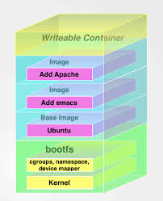

# Docker 파트-1

## 컨테이너 가상화이자 현재 인프라 스트럭쳐에서 모를수 없는 요소인 도커 혹은 다커~

### 그간 세션을 진행하거나 할때 많이 하지만 정확히 정리해놓은 글이 없어 정리해보는 시간을 가지기로 했다.

### 도커는?

> Docker는 가상화 기술이다. Docker 라는 회사가 container virtualization 을 개발하였고 그래서 docker가 container virtualization 기술의 또다른 이름으로 오해하시는 분들이 있는데 container virtualization은 docker 이전에 이미 개발되어 존재 하고 있었다. Docker는 가상화 컨테이너에 application 배포를 자동화 시켜주는 오픈소스 엔진이다.

> Docker는 container 가상화 실행 환경 위에 application 배포 엔진을 더함으로서 사용자의 코드를 어디서든 빠르고 가볍게 실행시킬수 있는 기술을 제공한다. 이는 요즘 널리 사용되는 MSA(Micro Service Architecture)와 CI/CD 와 아주 잘 조화되어서 많은 각광을 받게 된다. 실제로 docker는 한 컨데이너 당 하나의 application이나 프로세스를 실행하는 것을 권한다. MSA의 철학과 일맥상통 하는것이다.

### Docker 구조
#### Docker는 크게 4가지 부분으로 되어 있다.

- Docker client 와 server (server는 docker engine으로 불리기도 한다)
- Docker 이미지
- Docker registries
- Docker containers
- Docker client 와 server
- Docker는 클라이언트 와 서버 구조로 이루어저 있다. 클라이언트가 서버에 명령을 전달하고 서버가 실행시키는 구조이다. docker binrary 커맨드가 docker 클라이언트 이고 dockerd 가 docker daemon 혹은 docker engine이다. Docker engine과 interact하기 위한 Restful API도 제공된다. 클라이언트와 서버는 동일한 호스트 안에서 운영 될수도 있으며 서로 다른 호스트에서 운영 될수도 있다.

### Docker 이미지
> Docker의 life cycle에서 docker 이미지는 “build”의 부분에 해당된다. Docker container에서 실행시키고 싶은 application을 docker 이미지로 빌드해서 실행시키게 된다.

### Docker registries
> Docker registires는 docker 이미지를 저장하는 repository라고 보면 된다. Source code를 github에 저장하여 관리하듯 docker 이미지는 dockerhub 같은 docker registries에 저장한다고 생각하면 된다. Github가 마찬가지로 public registry 가 있고 private registry가 있다.

### Docker containers
> Docker container에서 docker 이미지가 실행된다. 즉 docker 이미지를 실행시키는 가상화 공간 이다. Docker container는 하나 혹은 그 이상의 프로세스를 실행 시킬수 있다 (하지만 하나의 프로세스만 실행시키는 것을 권장).

### Docker Compose And Swarm
> Docker에서는 여러 docker container들로 이루어진 stack이나 cluster를 관리 하는 서비스도 제공하는데 바로 docker compose 와 docker swarm이다.

> Docker compose는 복수의 docker container들을 모아서 종합적인 application stack을 정의 하고 운영할수 있도록 해주는 서비스이다. Compose 파일을 사용하여 전체적인 application 서비스를 설정한후, application을 이루고 있는 각각의 컨테이너들 (예를 들어, web 서버 컨테이너, api 서버 컨테이너 등등)을 따로 실행시킬 필요 없이 한번에 생성하고 실행할 수 있도록 해준다. Docker swarm은 docker containers 들로 이러우진 cluster를 관리할수 있도록 해주는 서비스이다. 즉 docker container를 위한 clustering tool 이다.

### Docker VS Configuration Management Tools
> Docker가 Chef나 Puppet, Ansible 같은 CM tool들을 대체하는가 에 대해서 물어보시는 분들이 많다. Docker를 사용함으로서 많은 CM(configuration management) 부분이 해결되는것은 맞지만 그래도 여전히 CM의 역활이 남아있다. 예를 들어, docker를 사용하기 위해서는 docker가 호스트에 설치되어 있어야 한다. 이러한 부분은 CM tool을 사용하여 관리할 수 있다.

### 그 외 Docker의 특징들
> Docker는 modern한 리눅스 커널이 설치되어 있는 x64 호스트에서는 다 실행 가능하다 하지만 커널 버젼 3.10 이상에서 실행되는 것이 overhead가 적기 때문에 권장된다. 최근에는 docker를 Windows 나 Mac에서도 사용 가능하다. 하지만 Windows 및 Mac에서 docker를 직접 실행시키면 내부적으로 가상머신이 실행되어 그 안에서 docker가 실행되기 때문에 개발용 및 테스트 용으로는 괜찮지만 production 용도로는 적합하지 않다. Docker 컨테이너는 독립된 root 파일 시스템이기도 하다 그러므로 파일 시스템 분리가 이루어져 있다. 또한 docker 컨테이너는 호스트와 분리된 프로세스 환경을 가지고 있으므로 독립적인 프로세스를 실행할수 있다. 파일 시스템과 프로세스 환경과 마찬가지로 네트워크 또한 분리 되어 있어서 독립적인 가상 네트워크 인터페이스 와 IP 주소를 가질 수 있다. Resource isolation and grouping - 커널의 cgroups 기능을 통해서 docker container마다 독립적인 CPU와 메모리 가 할당 될수 있다. Docker 파일 시스템은 copy-on-write 을 사용하여서 효율적이며 빠른 디스크 IO를 실행한다. Docker의 copy-on-write은 중요한 특징중 하나이므로 다음에 더 자세히 설명하겠다. Docker 컨테이너에서 STDOUT, STDERR, STDIN을 통해서 생성되는 로그들은 전부 수집되어서 분석하거나 trouble-shooting을 가능하게 해준다. 그뿐만 아니라, 실행되고 있는 docker container의 shell에 접속해서 interact할 수도 있다.

### Docker Images
> Docker image는 파일시스템들의 layer로 만들어져 있다. 가장 base layer는 boot filesystem bootfs로 일반적인 Linux boot 파일시스템으로 되어있다. Docker 유저가 직접적으로 boot filesystem을 사용할 일은 없으며, 실제로 container가 부팅이 되면 메모리로 옴겨지고 boot 파일시스템은 unmount된다.

> Boot layer 다음에는 rootfs 라고 하는 root 파일 시스템 layer이다. Root 파일 시스템은 실제 OS 가 설치된다(예를 들어 Debian 이나 Ubuntu). 원래 리눅스에서는 root filesystem은 처음 mount될때는 read-only로 mount가 된후 integrity check후 read-write으로 바뀐다. 하지만 Docker에서는 계속해서 read-only 모드이다. Read-write 모드로 변환하지 않는 이유는 Docker는 union mount를 사용해서 read-only 파일 시스템들을 root 파일 시스템 위에 덮는 구조로 이루어져 있기 때문이다. 참고로 union mount는 여러게의 파일 시스템을 mount하되 하나의 파일 시스템만이 mount된것 처럼 사용하는 방법이다.

> Docker 구조에서는 이러한 파일 시스템 하나 하나가 바로 image이다. 그럼으로 image들을 서로 위에 layer시키는 구조로 되어있다. Base가 되는 이미지를 부모 이미지라고하며 맨 위의 이미지 부터 가장 밑 부분의 이미지 까지 횡단 하는 구조로 되어있다. 즉 filesystem / image를 수정하는 구조가 아니라 read-only filesystem / image 들을 서로 위에 layer 시키되 union mount 기법으로 마지막에는 하나의 파일 시스템으로 보이는 구조를 가지고 있는 것이다.

> 모든 read-only 파일시스템들이 mount가 되고 docker 컨테이너가 이미지로부터 시작될때 docker는 마지막으로 read-write 파일 시스템을 파일 시스템 layer 맨 위에 mount한다. 마지막에는 read-only가 아니라 read-write으로 올려놓는 이유는 read-write 파일 시스템에 컨테이너가 필요한 프로세스를 생성하고 실행하기 위해서이다. 글로 설명하면 굉장히 어려울수 있지만 아래 그림을 보면 비교적 이해가 어렵지 않을것이다.



> 이러한 pattern을 copy on write이라고 한다. 이 copy on write 구조는 Dockerfile 을 이용해 docker image 를 빌드할때 효과적이다. Docker image를 빌드할때 Dockerfile의 각각의 instruction이 바로 filesystem / image가 되는것이다. 그러므로 빌드를 할때 처음부터 다 빌드하는 것이 아니라 바뀐 파일시스템만 mount하면 됨으로 효과적이고 빠르게 빌드 할 수 있으며 빌드가 도중에 실패하더라도 마지막으로 성공한 instruction은 빌드가 되어있는 상태이므로 그 이미지에 shell 접속을 해서 디버깅을 한다거나 하는 것이 가능해진다.

### 개념 정리가 이루어 졌다면 뭘해야 할까? 바로 실습이다!

#### 도커의 기본적인 실행에 앞서 상태를 보는 명령어

```docker
#도커 컨테이너 현황 보기
docker ps  # docker container ls 와 같다.
#전체 보기
docker ps -a  # docker container ls -a 와 같다.
#도커 이미지 목록 보기
docker images
#도커 이미지 전체 보기
docker images -a
```
#### 도커를 실행하려면

```docker
#우분투 서버를 올려보자
docker run --name '컨테이너 이름' -d ubuntu
# --name 옵션은 컨테이너 이름을 정해주는 옵션 만약 이 옵션이 빠지면? 영문 두단어로 이루어진 이름 조합이 생성된다
# ex) troy_siban
# -d 옵션은 데몬옵션(프로세스가 계속 실행되기 위한)
# 이미지가 이미 존재한다면 풀하지 않지만 존재하지 않으면 공개 리포에 공유되어 있는 이미지를 풀 해옴.
```
#### 도커의 삭제

```docker
#도커 컨테이너의 삭제 및 이미지 삭제
docker stop '컨테이너 명'
docker rm '컨테이너 명'
#모든 도커 컨테이너 삭제하기
docker stop $(docker ps -a -q)
docker rm $(docker ps -a -q)
#도커 이미지 제거
docker rmi '이미지 명'
#모든 도커 이미지 삭제하기
docker rmi $(docker images -q)
```
### 기본적인 플로우는 여기까지 하고 2부에서 DockerFile을 이용한 Python Django 배포를 진행하겠다.


