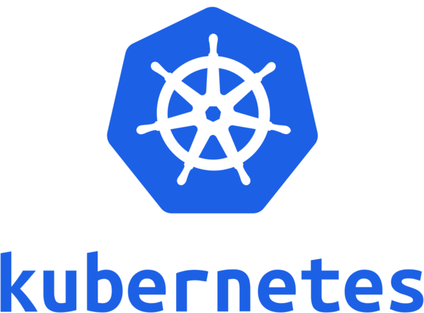
# Why? Kubernetes

쿠버네티스는 조종사 조타수를 뜻하는 그리스어입니다.

2013년 등장한 도커와 클라우드의 발전은 기존 모놀리스 방식에서 마이크로서비스로의 변화를 이끌었고, 이로 인해 기존에 비해 늘어난 개별적인 개발, 배포, 업데이트, 확장에 대한 규모가 커지면서, 이를 원할하게 구성, 관리, 유지하는 일이 어려워졌습니다. 또한 대량의 컨테이너를 일일히 사람이 관리하기란 매우 어려운 일입니다. 이로인해 등장한 것이 바로 쿠버네티스입니다.

쿠버네티스는 하드웨어 인프라를 추상화하고 데이터센터 전체를 하나의 컴퓨팅 리소스로 제공합니다.

1주일에 수십억 개의 컨테이너를 생성하는 구글이 내부 배포시스템으로 사용하던 [borg](https://kubernetes.io/blog/2015/04/borg-predecessor-to-kubernetes/)를 기반으로 2014년 프로젝트를 시작했고 여러 커뮤니티의 아이디어와 좋은 사례를 모아 빠르게 발전하고 있습니다.

단순한 컨테이너 플랫폼이 아닌 마이크로서비스, 클라우드 플랫폼을 지향하고 컨테이너로 이루어진 것들을 손쉽게 담고 관리할 수 있는 그릇 역할을 합니다. 서버리스, CI/CD, 머신러닝 등 다양한 기능이 쿠버네티스 플랫폼 위에서 동작합니다.

## MSA (Micro Service Achitecture)

-   마이크로서비스들은 모듈화 개념입니다. 마이크로서비스들의 목적은 대규모 소프트웨어 시스템을 작은 부분들로 나누는 것입니다. 따라서 이들은 조직과 소프트웨어 시스템의 개발에 영향을 미칩니다.
-   마이크로서비스는 서로에게 독립적으로 배포할 수 있으며, 한 마이크로서비스에 대한 변경은 다른 마이크로서비스의 변경과는 독립적으로 생산 환경에 적용할 수 있습니다.
-   마이크로서비스는 서로 다른 기술로 구현될 수 있습니다. 각각의 마이크로서비스에 대해 프로그래밍 언어나 플랫폼에 관련된 제약은 없습니다.
-   마이크로서비스는 자체적인 데이터 저장소(개별 데이터베이스 또는 공유된 데이터베이스 내에서 완전하게 분리된 스키마)를 갖습니다.
-   마이크로서비스는 검색엔진이나 특정 데이터베이스 같은 해당 서비스를 지원하는 서비스를 가질 수 있습니다. 물론, 모든 마이크로서비스에 대한 공통적인 플랫폼(예를 들어, 컨테이너 가상머신)도 있습니다.
-   마이크로서비스는 독립적인 프로세스나 서비스를 지원하기 위한 가상 머신(컨테이너)입니다.
-   마이크로서비스는 네트워크를 통해 통신해야 합니다. 이를 위해, 마이크로서비스는 REST나 메세징같은 느슨한 결함을 지원하는 프로토콜을 사용합니다.

[마이크로서비스란 무엇입니까? | AWS](https://aws.amazon.com/ko/microservices/)

[마이크로서비스](https://ko.wikipedia.org/wiki/%EB%A7%88%EC%9D%B4%ED%81%AC%EB%A1%9C%EC%84%9C%EB%B9%84%EC%8A%A4)

[마이크로서비스](https://www.aladin.co.kr/shop/wproduct.aspx?ItemId=90212803)

### 쿠버네티스의 구조

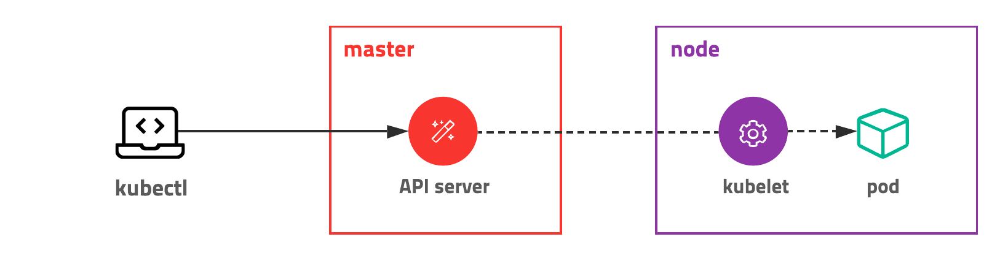

쿠버네티스는 전체 클러스터를 관리하는 마스터와 컨테이너가 배포되는 노드로 구성되어 있습니다. 모든 명령은 마스터의 API 서버를 호출하고 노드는 마스터와 통신하면서 필요한 작업을 수행합니다. 특정 노드의 컨테이너에 명령하거나 로그를 조회할 때도 노드에 직접 명령하는 게 아니라 마스터에 명령을 내리고 마스터가 노드에 접속하여 대신 결과를 응답합니다.

### 마스터(컨트롤 플레인)노드

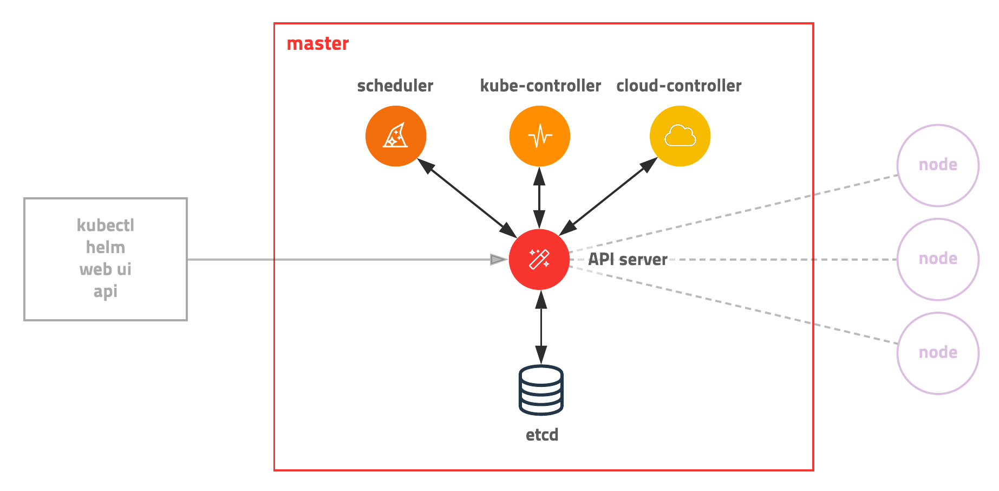

Master마스터 서버는 다양한 모듈이 확장성을 고려하여 기능별로 쪼개져 있는 것이 특징 고통 입니다. 관리자만 접속할 수 있도록 보안 설정을 해야 하고 마스터 서버가 죽으면 클러스터를 관리할 수 없기 때문에 보통 3대를 구성하여 안정성을 높입니다. AWS EKS 같은 경우 마스터를 AWS에서 자체 관리하여 안정성을 높였고(마스터에 접속 불가) 개발 환경이나 소규모 환경에선 마스터와 노드를 분리하지 않고 같은 서버에 구성하기도 합니다.

-   쿠버네티스 API서버는 사용자, 컨트롤 플레인 구성요소와 통신합니다.
-   스케쥴러는 애플리케이션의 배포를 담당합니다.
-   컨트롤러 매니저는 구성요소 복제본, 워커 노드 추적, 노드 장애 처리 등과 같은 클러스터단의 기능을 수행합니다.
-   Etcd는 클러스터 구성을 지속적으로 저장하는 신뢰할 수 있는 분산 데이터 저장소입니다.

### 워커노드

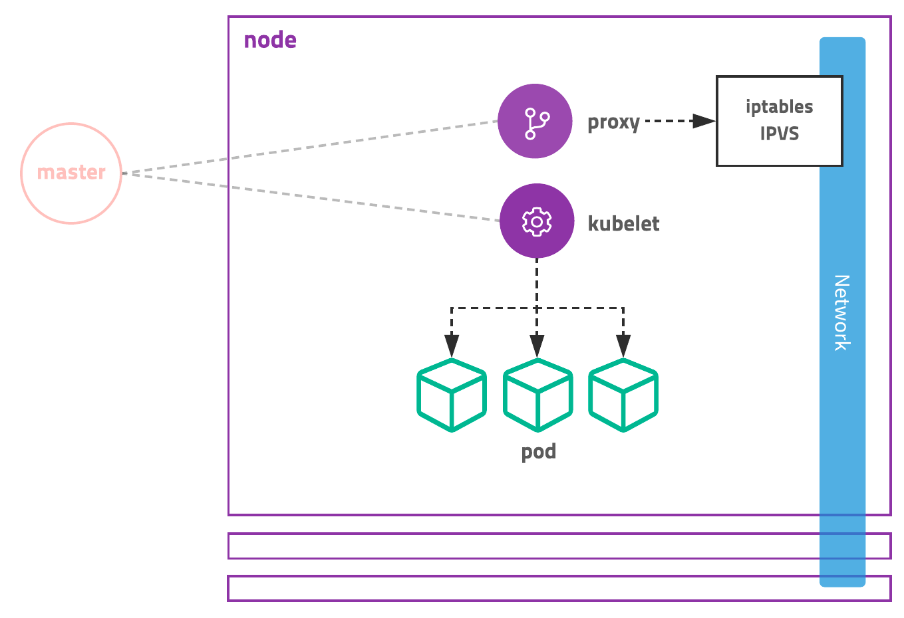

워커 노드는 컨테이너화 된 애플리케이션을 실행하는 시스템입니다. 애플리케이션을 실행하고 모니터링하며 애플리케이션에 서비스를 제공하는 작업은 다음 구성 요소에 의해 수행됩니다.

-   컨테이너를 실행하는 도커,rkt 또는 다른 컨테이너 런타임
-   API서버와 통신하고 노드의 컨테이너를 관리하는 kubelet
-   애플리케이션 구성 요소 간에 네트워크 트래픽을 로드밸런싱하는 쿠버네티스 프록시

### 쿠버네티스가 파드를 생성하는 과정

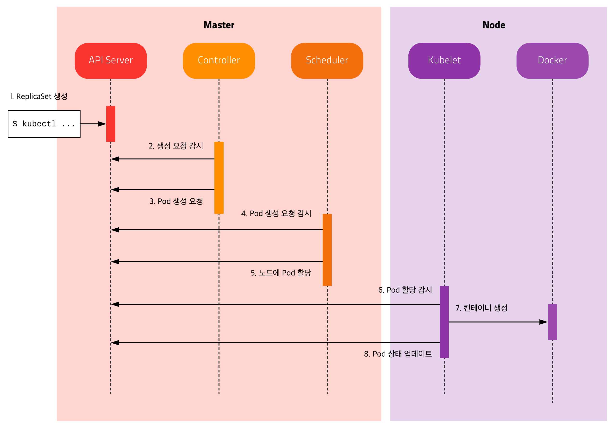

각 모듈은 서로 통신하지 않고 오직 API 서버와 통신합니다.

API 서버를 통해 Etcd에 저장된 상태를 체크하고 현재 상태와 원하는 상태가 다르면 필요한 작업을 수행합니다.

### 컨테이너 = 파드(pods)

파드는 하나의 개별적인 컨테이너가 아닌 컨테이너의 그룹을 의미합니다.

쿠버네티스는 개별적인 컨테이너를 직접 다루지 않습니다.

쿠버네티스에서 배포할 수 있는 가장 작은 단위로 한 개 이상의 컨테이너와 스토리지, 네트워크 속성을 가집니다. Pod에 속한 컨테이너는 스토리지와 네트워크를 공유하고 서로 localhost로 접근할 수 있습니다. 컨테이너를 하나만 사용하는 경우도 반드시 Pod으로 감싸서 관리합니다.

파드는 하나 이상의 밀접하게 연관된 컨테이너의 그룹으로 같은 워커노드에서 같은 리눅스 네임스페이스로 함께 실행됩니다. 각 파드는 자체 IP, 호스트이름, 프로세스 등이 있는 논리적으로 분리된 머신입니다.

### ReplicaSet 레플리카 셋

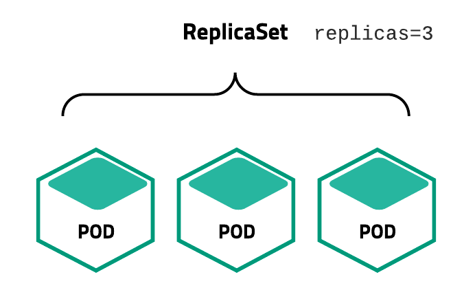

Pod을 여러 개(한 개 이상) 복제하여 관리하는 오브젝트입니다. Pod을 생성하고 개수를 유지하려면 반드시 ReplicaSet을 사용해야 합니다. ReplicaSet은 복제할 개수, 개수를 체크할 라벨 선택자, 생성할 Pod의 설정값(템플릿)등을 가지고 있습니다. 직접적으로 ReplicaSet을 사용하기보다는 Deployment등 다른 오브젝트에 의해서 사용되는 경우가 많습니다.

### Service 서비스

네트워크와 관련된 오브젝트입니다. Pod을 외부 네트워크와 연결해주고 여러 개의 Pod을 바라보는 내부 로드 밸런서를 생성할 때 사용합니다. 내부 DNS에 서비스 이름을 도메인으로 등록하기 때문에 서비스 디스커버리 역할도 합니다.

### Volume 볼륨

저장소와 관련된 오브젝트입니다. 호스트 디렉토리를 그대로 사용할 수도 있고 EBS 같은 스토리지를 동적으로 생성하여 사용할 수도 있습니다. 사실상 인기 있는 대부분의 저장 방식을 지원합니다.

###  파드의 이해 / 필요성

[쿠알못이 Amazon EKS로 안정적인 서비스 운영하기 - 최용호(넥슨코리아) :: AWS Community Day 2020](https://www.slideshare.net/mobile/awskr/amazon-eks-aws-community-day-2020)

파드는 여러개의 컨테이너를 가질 수 있지만, 여러개의 컨테이너들이 모여서 함께 실행되었을 때 의미있는 경우가 아니고서야 분리된 파드에서 컨테이너를 실행하는 것이 좋음.

파드를 분리하면 좋은 예 (백엔드/프론트엔드 컨테이너 분리, 마이크로 서비스 아키텍쳐)

[Microservices](https://martinfowler.com/articles/microservices.html)

파드안에 여러 컨테이너와 뷸륨을 두면 좋은 예 (ch6, p. 261)

### YAML로 파드 생성

```bash
kubectl create -f [yaml]
```

파드를 만들고 GCP나 AWS에서 확인해보자!

### 레이블을 이용한 파드 구성

yaml 파일에 labels 를 지정해서 파드를 생성해도 되고 만든 후에 추가해도 되고 수정도 가능

```yaml
apiVersion: v1
kind: Pod
metadata:
  name: label-demo           <-- 파드 이름
  labels:                    <-- 레이블 지정
    environment: production
    app: nginx
spec:
  containers:
  - name: nginx              <-- 컨테이너 이름
    image: nginx:1.14.2      <-- 컨테이너를 만드는 컨테이너 이미지, 책에서는 docker계정/kubia
    ports:
    - containerPort: 80
```

[Labels and Selectors](https://kubernetes.io/docs/concepts/overview/working-with-objects/labels/)

레이블을 왜 쓰는가 ? 

마이크로서비스 아키텍쳐(MSA)를 구성할 때 클러스터안에 분류되지 않은 파드들을 체계적으로 구성하고 결국은 인프라를 효과적으로 설계하고 컨테이너를 포함하고 있는 파드들을 오케스트레이션 하기 위함

### 레이블 셀렉터

레이블 셀럭터는 특정 키와 값에 따라 필터링해서 같은 기준에 따라 필터링된 파드에 작업을 수행할 때도 사용

노드 나열 : -l

추가 열 붙여서 표시 : -L

### 워커노드 분류에 레이블 사용

레이블은 파드에도 추가할수 있지만 노드에도 추가할 수 있음

워커 노드 ?

[Nodes](https://kubernetes.io/docs/concepts/architecture/nodes/)

[Standardized Glossary](https://kubernetes.io/docs/reference/glossary/?fundamental=true#term-node)

그래서 워커노드에 레이블 왜쓰냐 ?

GPU 자원이 필요한 딥러닝 학습이나 최적화에 특정 파드를 GPU 자원을 지원하는 노드에 스케쥴링 하고 싶을 때 사용

### 파드에 어노테이션 추가

파드와 같은 다른 쿠버네티스 오브젝트에 설명을 추가할 때 사용

어노테이션을 JSON으로 추가해서 나중에 파싱해서 JSON그대로 사용할 수도 있을 것 같고 레이블보다 더 큰용량의 주석을 추가할 수 있다. (256KB까지)

### 네임스페이스를 사용한 리소스 그룹화

기본적으로 동일한 리소스를 중첩되지 않도록 다른 네임스페이스로 분리해서 사용하기 위함이며 다른 네임스페이스 별로 같은 레이블을 달아서 필터링에 효과적으로 레이블 셀럭터를 사용할 수 있음.

-   쿠버네티스 클러스터에 있는 모든 네임스페이스 확인 명령어

```bash
kubectl get ns
```

-   특정 네임스페이스에 속한 파드를 출력하는 명령어

```bash
kubectl get po --namespace kube-system
```

네임스페이스는 리소스들을 그룹으로 격리 하는 것 외에도 특정 사용자가 지정된 리소스에 접근할 수 있도록 허용하고, 개별 사용자가 사용할 수 있는 컴퓨팅 리소스를 제한하는 데에도 사용되므로 12~14장에서 자세히 공부하자!

-   YAML파일로 네임스페이스 생성

```bash
kubectl create -f custom-namespace.yaml
```

-   쿠버네티스 cli로 네임스페이스 생성

```bash
kubectl create namespace custom-namespace2
```

-   생성한 네임스페이스, custom-namespace 에 파드 생성 (yaml에 지정해도 되고 인자로 직접 줘도 됨)

```bash
kubectl create -f kubia-manual.yaml -n custom-namespace
```

-   모든 네임스페이스의 파드를 보는 다음 명령어로 각각 네임스페이스에 동일한 이름을 가진 kubia-manual 파드가 있는지 확인

```bash
kubectl get pods --all-namespaces
```

-   모든 컨텍스트 확인 명령

```bash
kubectl config get-contexts
```

네임스페이스만 다르게했다고 격리가 되는것은 아니고 파드간 네트워크 인프라 설정에 따라서 foo 네임스페이스 안에 있는 파드가 bar 네임스페이스 안에 있는 파드의 IP주소를 알면 http request를 다른 파드로 전송할 수 도 있다.

관리되는 파드!

레플리케이션 컨트롤러 (rc)

```bash
kubectl get pods

kubectl get rc
```

### liveness probe 라이브니스 프로브

컨테이너 운영 중 크래시가 발생하면 kubelet이 컨테이너를 다시 실행한다. 하지만 잘못 프로그래밍 된 경우에는 프로그램은 잘못되도 프로세스는 계속 유지된다. 이러한 경우 외부에서 애플리케이션의 체크를 통해

재시작 하도록 할수 있다.

liveness probe 라이브니스 프로브를 통해 컨테이너의 정상 작동 여부를 확인할 수 있는데, 이는 pod의 spec 부분에 설정할 수 있다.

예시로 나온 HTTP GET 프로브는 IP주소, 포트, 경로에 GET 요청을 수행하고 이상이 있을경우 다시 시작한다.

그외에 TCP 소켓 프로브, Exec 프로브가 있다.

잘 작동하지 않는 이미지를 배포하고, 해당 파드 배포 생성을 위한 yaml을 작성할때

liveness probe 예시.

```bash
spec:
	containers:
	- image: ...
		livenessProbe:
		httpGet:
			path: /
			port: 8080
```

kubectl describe 로 확인해보면 상태값 옵션값 및 최하단에는 종료이유를 로깅해준다.

```bash
liveness: http-get http://:8080/ delay=0s(컨테이너가 시작되고 프로브가 시작되는 시간설정) timeout=1s(컨테이너가 응답해야하는 허용시간) period=10s(프로브의 실행주기) #success=1(성공 카운트) #failure=3(실패 카운트) 
```

-   라이브니스 프로브는 운영중인 컨테이너에 효과적인 방법이다.
    
-   라이브니스 프로브는 애플리케이션의 내부만 체크하고, 외부요인의 영향을 받지 않도록 해야함.
    
    ```
     ex) 데이터베이스가 응답하지 않는 웹서버는 실패를 반환해서는 안됨. 원인이 데이터베이스에 있기 때문. 잘못된 재시작은 원인을 찾기 어려워진다.
    ```
    
-   연산리소스를 가볍게 해야하며, 1초내에 완료되는게 좋다. 너무 많은일을 하는 프로브는 컨테이너 리소스를 잡아먹고 느려지게 한다.
    
-   라이브니스 프로브는 마스터 노드에서는 관여하지 않는다. 노드 크래시가 났을때 대체 노드를 제공할때는 마스터 노드에서 관여한다.
    
-   따라서 라이브니스 프로브 만으로는 노드 크래시는 해결 할 수 없다.
    

### 레플리케이션 컨트롤러 이하 rc

레플리케이션 컨트롤러는 클러스터에서 노드가 사라지거나 노드에서 파드가 제거된 경우, 사라진 파드를 감지해 교체 파드를 생성한다.

-   레이블 셀렉터 : 레플리케이션컨트롤러의 범위에 있는 파드를 결정.
-   레플리카 수: 실행할 파드의 수 지정.
-   파드 템플릿: 새로운 파드 레플리카를 만들때 사용한다.

rc 설정후 생성된 파드는 rc의 관리를 받으므로, 삭제시 다시 복구된다.

파드가 삭제되면 컨트롤러는 새 교체 파드를 만든다.

하지만, 이 동작의 원리는 삭제에 반응하는것이 아니다.

삭제를 통보 받으면, desired 되야하는 파드수와 current 파드수를 확인한뒤 비교 후 다시 요건을 맞추기 위해 새로 생성하는 것이다.

노드에 장애가 생겼을 경우, 새로운 파드가 생성된다.(장애가 없는 노드로의 이전)

특정 파드의 레이블에 단순히 값을 추가하는 것에는 영향이 없지만, 레이블을 변경하게 되면, 추가로 레이블을 지닌 파드를 새로 생성하고, 변경된 파드는 rc의 관리를 받지 않는 파드로 변하게 된다.(삭제하지 않는다.)

파드의 스케일링

```jsx
kubectl scale rc kubia --replicas=10
```

edit 시에는

```jsx
#yaml
...
spec:
replicas: 3  <===이부분을 조정후 저장
```

```
   rc 삭제시 파드는 보존하려면
```

```jsx
kubectl delete rc kubia --cascade=false
```

### 레플리카 셋

레플리케이션 컨트롤러에 비해 보다 세분화된 파드 설정이 가능한 레플리케이션 수단, 후에 디플로이먼트와 밀접한 관계가 있음.

레플리케이션 컨트롤러는 레이블 두가지를 동시에 매칭할 수 없지만, 레플리카 셋은 두가지를 동시에 매칭할 수 있다. 또한 key 만으로도

매칭 할 수 있다.

간단한 차이이면서 중요한 것

apiVersion: apps/v1beta2 를 기억하자.

파드 레이블이 이미 존재하면 새로 생성하지 않고 자신의 관리로 전환한다.

matchLabels와 matchExpressions

matchLabels: 일치하는 레이블에 대해 관리.

matchExpressions: key가 일치하는가, 레이블 이름이 일치하는가 등의 세부적 조건을 설정가능.

In : 레이블의 값이 지정된 값 중 하나와 일치 해야함.

NotIn: 레이블의 값이 지정된 값과 일치하지 않아야 함.

Exists: 지정된 key를 가진 파드만 포함되야 함. value는 중요하지 않음 따라서 이 연산자는 label 값을 지정할 필요가 없다.

DoesNotExists: 파드에 지정된 키를 레이블이 포함하지 않아야 함

### 데몬셋

클러스터의 모든 노드에 노드당 하나의 파드만 실행되길 원하는 경우에 데몬셋을 사용해볼 수 있다.

데몬셋은 복제본의 개념이 없음(rs, rc)와 차이점. 다만 노드가 다운됐을때 자동 생성하지 않고, 새로운 노드가 추가되면 다시 파드를 생성한다.

파드가 유실되면 다시 파드 템플릿으로 생성한다.

노드를 지정해주지 않으면 데몬셋은 모든 노드에 파드를 배포.

node-selector 속성으로 노드를 지정한다.

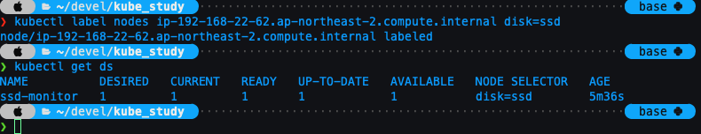)

node label을 바꿈에 따라 생성 여부

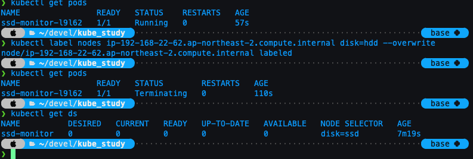)

### 잡 리소스

특정 작업에 대한 컨트롤을 위한 job을 설정해서 파드를 관리할 수 있다.

기본 배치 잡.

멀티 파드 실행

병렬 파드 실행

크론 잡 실행. (리눅스 크론탭 처럼 사용가능)

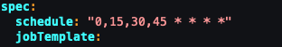

## 서비스! 서비스는 무엇인가!

기존방식은 시스템Admin 이 클라이언트 구성파일에 서비스를 제공하는 서버의 정보를 주입해 각 클라이언트 애플리케이션을 구성함.

쿠버는 이런식으로 하면 안된다.

이유는 다음과 같다.

-   파드는 일시적이다. 파드는 언제든 사라질 수 있으며, 고착화 되지 않는다.(휘발성)
-   쿠버네티스는 노드에 파드를 스케쥴링한 후 파드가 시작되기 바로 전에 파드의 IP 주소를 할당한다. 따라서 클라이언트는 미리 알수 없다.
-   수평 스케일링은 여러 파드가 동일한 서비스를 제공할 수 있음을 의미한다. 클라이언트는 서비스를 지원하는 파드의 수와 IP에 상관하면 안된다. 개별 IP 목록을 유지할 필요가 없다. 대신 모든 파드는 단일 IP주소로 접근이 가능해야 한다.

위의 이유로 쿠버네티스는 Service 서비스를 제공한다.

쿠버네티스의 서비스는 동일한 서비스를 제공하는 파드 그룹에 지속적인 단일 접점을 만들려고 할때 생성하는 리소스다.

(Like LoadBalancer)

예시로 나온 서비스는 프론트와 백엔드간의 연결시 변하는 상황에 따른 문제를 겪지 않도록 각각 파드에 서비스를 만들어서 서로 파드의 영향없이 서비스를 통해 접근되도록 하는 예시이다.

서비스 역시 특정 그룹의 연결을 위해 label selector를 이용해 그룹을 지정 할 수 있다.

서비스 생성하는 가장 쉬운 방법

```bash
kubectl expose rc kubia --type=LoadBalancer --name kubia-http
```

위는 2장의 예시다.

yaml을 통해서도 당연히 만들수 있다.(과정은 생략)

생성한 서비스를 조회하는 명령어 옵션

```bash
kubectl get svc
```

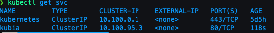

실습간 pod레이블을 잘못 설정했었는데, 그채로 서비스 생성하니 exec 때 연동이 안됐음.

다시 레이블 변경후 재호출 하니 잘됨(편안~)

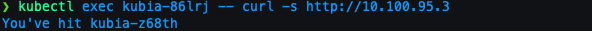

exec 가 하는 일은 도커와 같다. 도커에도 실행중인 컨테이너에 명령어 전달하려면 exec를 사용.

옵션간 — 의 의미는 kubectl 명령어가 끝났음을 의미.

호출을 지속적으로 서비스에 진행하다 보면 LB처럼 응답하는 파드가 변경된다.

만약 매번 같은 파드가 응답하길 원한다면 sessionAffinity옵션의 값을 None에서 ClientIP로 설정한다.

어피니티 옵션을 ClientIP로 변경하고 요청을 보내면 요청한 파드만 응답한다.

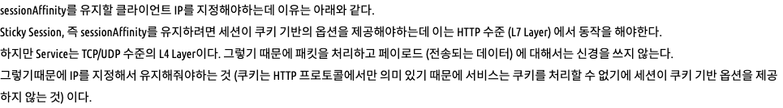

출처: [](https://lascrea.tistory.com/202)[https://lascrea.tistory.com/202](https://lascrea.tistory.com/202)

동일한 서비스에서 여러 개의 포트 노출

하나의 서비스에서 멀티포트를 지원하려면 각 포트의 이름을 지정해야 한다.

이름 및 용도의 포트들을 지정하고 파드의 타켓 포트도 작성해준다.


이렇게 생성된 서비스에 파드를 생성시 포트 네임을 지정하면 바로 적용이 가능하다.

후에 포트가 변경시에는 이름을 변경하는게 아니라 파드 스펙에서 포트번호를 변경하면 된다.

### 서비스 검색

서비스가 한번 생성되면 서비스가 지워지지 않는 한 파드는 삭제되고 새로 생서되기도 한다. 하지만 언제나 서비스의 IP로 접근할 수 있어야 하는데, 다음과 같은 방법들을 제공 한다.

1.  환경변수를 통한 서비스 검색
    
    ```bash
    kubectl exec 파드명 -- env
    ```
    
    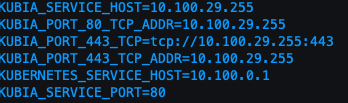
    
2.  DNS를 통한 서비스 검색
    
    kube-dns 에서 자체 처리
    
    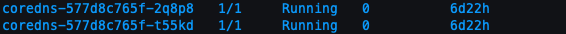
    
    파드가 내부 DNS 서버를 사용할지 여부는 각 파드 스펙의 dnsPolicy속성으로 구성할 수 있음.
    

FQDN

호스트와 도메인을 함께 명시하여 전체 경로를 모두 표기하는 것을 FQDN 이라 한다.

FQDN와 달리 전체 경로명이 아닌 하위 일부 경로만으로 식별 가능하게 하는 이름을 PQDN(Partially~)라 한다.

쿠버네티스의 경우 다른 Pod를 찾을 시 동일 네임스페이스 안에서 찾을 때에는 PQDN을 사용할 수 있지만,

네임스페이스 외부에서 찾을 때에는 FQDN을 사용해야 한다

명칭만 정확히 아는것만이 아니라 포트번호도 알고 있어야 한다.

서비스연결 파드에 직접 접속해서 bash 실행. (like Docker)

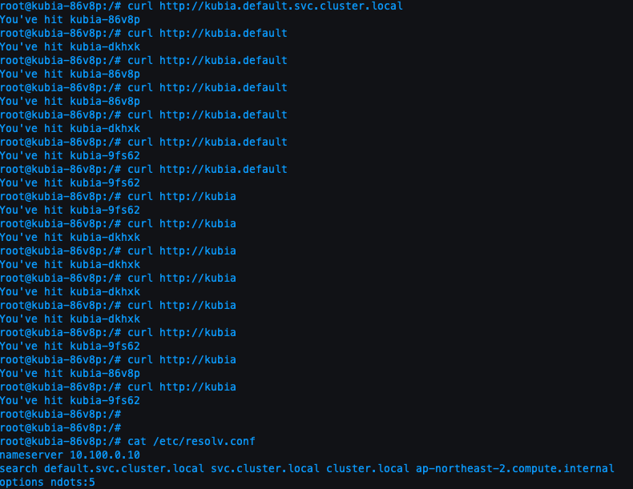

위의 축약이 가능한 이유는 컨테이너에 resolv.conf에 이미 잘 명시가 되어 있어서 이다.

## 클러스터 외부에 있는 서비스 연결

서비스 기능을 사용해 외부 서비스로 연결을 전달할 수도 있다.

### 서비스 엔드포인트

서비스는 직접적으로 파드를 연결하지 않는다. 서비스 엔드포인트를 통해 접근할 뿐이다.

describe로 svc를 조회하면 엔드포인트를 조회할 수 있다.

```bash
kubectl get endpoints kubia 
```

셀렉터는 IP와 포트 목록을 작성하는 데 사용되며, 엔드포인츠에 저장된다.

### 서비스 엔드포인트 수동구성

파드 셀렉터 없이 서비스를 만들면 쿠버네티스는 엔드포인트 리소스를 만들지 못한다. 수동으로 생성하려면 서비스와 엔드포인트 리소스 모두 만들어야 한다.

또한 externalName을 이용해서 직접 외부 주소를 전달 할 수도 있다.

이렇게되면 서비스는 내부 DNS가 아닌 외부 도메인으로 연결하게 된다. 추후 서비스 연결을 변경할 경우 externalName 속성을 수정하거나, ClusterIP 로 변경 후 서비스 스펙을 만들어 다른 서비스를 가리키도록 할수도 있다.

ExternalName 서비스는 DNS 레벨에서만 구현된다. CNAME레코드가 생성되어, 연결 시 바로(FQDN) 외부 연결을 하도록 한다.

따라서 ExternalName 유형의 서비스는 ClusterIP를 얻지 못한다.

### 외부 클라이언트에 서비스 노출

외부에서 서비스를 접근하게 하려면 ,

### NodePort 로 서비스를 생성

각 클러스터 노드는 노드 자체에서 포트를 개방하고 해당 포트로 수신된 트래픽을 서비스로 전달한다.

### 서비스 유형을 LoadBalancer로 설정

클라우드 인프라에 프로비저닝된 로드밸런서로 서비스에 접근할 수 있다. 로드밸런서는 모든 노드의 노드포트로 트래픽을 전달한다.

### 단일 IP주소로 여러 서비스를 노출하는 Ingress 리소스 생성

HTTP(7계층)에서 동작하는 서비스로 4계층(TCP/UDP)보다 더 많은 기능을 제공할 수 있다.

1.  NodePort 서비스
    
    spec: type에 NodePort로 설정
    
    nodePort를 지정해서 클러스터 노드에 지정된 포트로 액세스 하게 함.
    
    각 노드에 30123 포트를 호출해야 하는데 EXTERNAL-IP를 조회해서 30123 포트에 curl 을 하면 조회된다.
    
    물론 EKS도 방화벽에 규칙등재해야 curl 리턴이 온다.
    
    단점, 노드에 장애가 나면 클라이언트는 더 이상 서비스에 접근할 수 없다.
    
    이를 보완하기 위해 다음의 로드밸런서를 보자.
    
2.  LoadBalancer
    

로드밸런서는 단순히 타입을 지정하면 클라우드에 있는 로드밸런서를 연결한다.

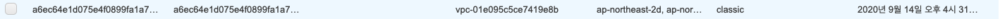

뿅 하고 생성됨! ( 미니쿠베 OTL)

aws는 public IP대신 퍼블릭 dns로 주소를 줌.

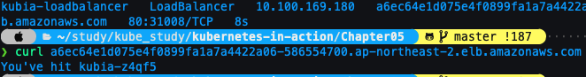

잘 됩니다~!

이미 로드밸런서 구성으로 훌륭해 졌지만, 로드 밸런싱의 구조상 클라이언트가 노드포트를 통해 접근할 경우, 임의 로 선택된 파드가 동일한 노드에서 실행중일 수도 있고, 아닐 수 도 있다. 아닐 경우는 추가적으로 노드를 순회해야 하므로, 불필요한 지연이 발생될 수 있다. 따라서 ExternalTrafficPolicy필드의 옵션을 Cluster에서 Local로 변경하면, 외부의 연결을 수신한 노드에서 실행중인 파드로만 트래픽을 전달 할 수 있다.

이렇게 하면 각 노드에 있는 파드로의 전달은 이루어진다. 하지만 노드마다 파드수가 다르므로 부하 분산에는 좋지 않다.

nodeport를 사용하면 패킷에서 소스 네트워크 변환이 이루어져서 클라이언트 IP를 볼 수 없어 문제가 될 수 있다.

3.  Ingress 서비스

로드밸런서 서비스는 자신의 공용IP 주소를 가진 로드밸런서가 필요하지만, Ingress는 한 IP주소로 수십개의 서비스에 접근이 가능하도록 지원해준다. 인그레스는 경로에 따라 전달을 한다. 7계층에서동작(HTTP) 쿠키 기반 세션 어피니티도 제공한다

(그럼 첨부터 이걸 쓰라고 하지....)

라고 썼지만 여기서부터 지옥이 펼쳐진다. EKS ingress

(잠시 후퇴)

minikube 너무 잘됩니다 ㅡㅜ AWS는 구조상의 이유로 ALB 컨트롤러를 EKS가 제어할수 있도록 설정해야 하는데, 아직 그부분이 매끄럽게 되지 않아서 시간 소요가 있을것 같네요. 일단 minikube에서는 너무 잘되고 아마도 gcp도 잘될거라 생각됩니다.

본론으로 돌아와서 인그레스는 직접적인 도메인주소 DNS로 부터 IP정보를 제공하고 클라이언트가 요청시 컨트롤러는 헤더에서 클라이언트가 요청하려는 서비스를 결정하고 서비스와 관련된 엔드포인트 파드로 전달한다.

인그레스는 여러개의 서비스를 핸들할 수 있도록 되어 있고, 직접 서비스에 전달하지 않는다. 파드를 선택하는데에만 사용한다.

같은 IP주소의 인그레스를 통과하지만, 설정된 경로와 노드에 따라 다른 서비스로 연결이 가능하다.

또한 인증서를 입혀서 https도 적용가능하다!(이게 이렇게 한줄에 정리해도 되는건지 모르겠습니다)

### 레디니스 프로브

파드가 연결을 수락할 준비가 됐을 때 신호보내기.

파드가 레이블을 가지고 레이블이 일치하는 서비스에 연결되는데 파드가 만들어지자 마자 서비스는 요청을 시작한다. 하지만 파드 생성후 서비스 프로세스가 실행되기까지 시간이 걸리는 경우도 있다. 이런때를 대비해서 트리거가 필요하다.

-   exec 프로브 : 프로세스의 종료 상태 코드로 판단.
-   HTTP GET 프로브 : 응답상태 코드
-   TCP 소켓 프로브 : 소켓 연결 여부

컨테이너가 시작될때 레디니스 점검 시작 타이밍을 initialDelaySeconds로 지정 가능.

파드가 준비되지 않았다면 제거. 정상이면 주기적으로 체크

라이브니스 프로브와 달리 컨테이너가 준비상태 점검에 실패해도 종료되거나 다시 시작하지 않는다.

레디니스 프로브는 요청을 처리할 준비가 된 파드의 컨테이너만 요청을 수신하도록 한다.

레디니스 프로브를 사용하면 클라이언트가 정상 상태인 파드하고만 통신하고 시스템에 문제가 있다는 것을 절대 알아차리지 못한다.

레디니스 프로브에서 강조해야 할 두가지

-   파드에 레디니스 프로브를 추가하지 않으면 파드가 시작하는 즉시 서비스 엔드포인트가 된다. 항상 서비스가 온전히 수행할 수 있는 상태를 가지도록 레디니스 프로브를 정의하라.
-   레디니스 프로브에 파드의 종료코드를 포함하지 말것. 파드를 제거하는 코드는 필요없다.

헤드리스 서비스로 개별 파드 찾기

클라이언트가 모든 파드에 연결하려면 각 파드의 IP를 알아야한다. 쿠버네티스 API를 통해 확인할 수 있지만, 애플리케이션을 k8s와 무관하게 유지하려고 노력해야 하므로, 이는 바람직하지 않다.

보통 DNS를 통해 조회할 수 있는데, 이때 서비스 설정 중 clusterIP필드 값을 None으로 설정하면, DNS 서버는 하나의 IP대신 파드 IP들을 반환한다.

None 옵션은 바로 헤드리스 옵션이다.

dnsutils를 이용해서 조회해보면 준비된 파드는 서비스 엔드포인트에 연결되어 응답했다.

만약 준비된 파드만이 아닌 모든 파드를 조회하고 싶다면 아래의 어노테이션을 추가한다.

```bash
 service.alpha.kubernetes.io/tolerate-unready-endpoints: "true"
```

서비스 문제해결하기

1.  외부가 아닌 클러스터 내에서 서비스의 클러스터 IP에 연결되는지 확인한다.
2.  서비스에 엑세스할 수 있는지 확인하려고 서비스 IP로 핑을 할 필요없다.
3.  레디니스 프로브를 정의했다면 성공했는지 확인하라.
4.  파드가 서비스의 일부인지 확인하려면 kubectl get endpoints를 사용해 확인한다.
5.  FQDN이나 그 일부로 서비스에 엑세스하려고 하는데 작동하지 않는 경우 FQDN대신 클러스터 IP를 사용해 엑세스할 수 있는지 확인 한다.
6.  대상 포트가 아닌 서비스로 노출된 포트에 연결하고 있는지 확인한다.
7.  파드 IP에 직접 연결해 파드가 올바른 포트에 연결돼 있는지 확인한닫.
8.  파드IP로 애플리케이션에 액세스할 수 없는 경우 애플리케이션이 로컬호스트에만 바인딩하고 있는지 확인한다.

### 디플로이먼트

레플리카셋 기능을 활용한다. 리소스를 통해 선언적인 애플리케이션 업데이트를 가능하게 한다.

파드의 업데이트!

파드는 기본적으로 레플리케이션 컨트롤러나 레플리카 셋 모두 지원한다.

또는 외부서비스와 연결된 파드의 경우 클라이언트와 직접 엑세스되기도 한다.

파드에 담긴 APP에 버전 업데이트 한다고 가정했을때, 파드를 갱신하는 방법은 두가지가 있다.

1.  기존 파드를 모두 삭제한 다음 새 파드를 시작한다.
2.  새로운 파드를 시작하고, 기동하면 기존 파드를 삭제한다. 새파드를 모두 추가한 다음 한꺼번에 기존 파드를 삭제하거나 순차적으로 새파드를 추가하고 기존 파드를 점진적으로 제거해 이 작업을 수행할 수 있다.

1번의 단점은 짧은 시간동안 다운타임이 발생한다.

2번의 단점은 두가지 버전을 동시에 실행해야 한다.

RC에서 수동으로 업데이트 하는 사례 1

레플리케이션에서 관리되는 파드는 템플릿을 수정하고 기존 파드를 삭제시 레이블 셀렉터와 일치하는 파드가 없을시 새 인스턴스를 시작한다.

Blue/Green deployment

바꾸려는 버전의 파드를 미리 생성하고, 서비스의 셀렉터를 변경 할 수 있다. 이방식은 블루/그린 배포라고 말한다. 이경우에는 한번에 많은 파드가 실행되므로 리소스를 많이 잡아먹는 단점이 있다.

rolling update

파드를 한번에 모두 실행하고 한번에 삭제하는 방법 댓힌 파드를 단계별로 교체하는 롤링 업데이트도 할 수 있다. 수동으로 할 경우 이 모든 일을 수동으로 진행해야 하므로, 어렵고 오류가 발생할 수 있다.

rc를 통해 자동 롤링 업데이트 수행.

```bash
kubectl rolling-update kubia-v1 kubia-v2 —image="luksa/kubia:v2" 
```

라고 나오지만 Deprecated된 명령어 이기 때문에 굿바이.

그렇다면 왜 제거했을까? 더 나은 대안이 있기 때문이다.

이런 방식의 롤링업데이트는 클라이언트를 통해서 지원되기 때문에 안전보장이 되지 않는다.

진행중 클라이언트의 통신이 끊어질 경우, 중단될 수 있기 때문이다. 또한 이러한 수동적 방식은

쿠버네티스가 선언적 설정에 따라 움직이는 방식에서 멀어지는 직접적인 방식이다.

따라서 우리는 이러한 부분을 선언적 방식으로 대처할 수 있는 Deployment를 사용해서 해결할 수 있다.

Deployment

디플로이먼트는 레이블 셀렉터, 레플리카 수 , 파드 템플릿으로 구성된다. 또한 업데이트 방식을 설정하는 필드도 지원한다.

```yaml
apiVersion: apps/v1
kind: Deployment
metadata:
  name: kubia
spec:
  replicas: 3
  template:
    metadata:
      name: kubia
      labels:
        app: kubia
    spec:
      containers:
      - image: luksa/kubia:v1
        name: nodejs
  selector:
    matchLabels:
      app: kubia
```

디플로이먼트를 사용하게 되면 디플로이먼트를 통해 rc- pod가 관리된다.

```bash
k create -f kubia-deployment-v1.yaml --record   
#레코드 옵션은 리비전 기록을 볼수 있는 좋은 커맨드 옵션 
```

디플로이먼트가 생성되고 파드와 레플리카셋을 조회해보면 특징이 있다.

디플로이먼트는 파드를 직접 관리하지 않고 레플리카 셋을 통해 관리한다. 따라서 파드의 이름에 해시값이 추가 되는데, 이는 바로 레플리카 셋에 적용된 해시값이다.

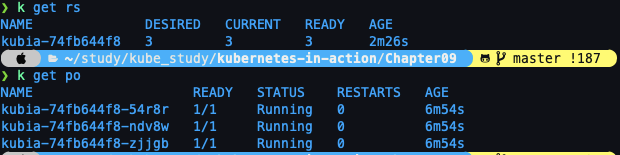

디플로이먼트의 업데이트 전략

-   RollingUpdate : 이전의 방식대로 순차적으로 개별적 파드 교체
    
-   Recreate: 한번에 지우고 한번에 새로 만들기
    

스펙 변경 하는 명령어

```bash
kubectl patch deployment kubia -p '{....}'
```

컨테이너 이미지 교체 하는 명령어

```bash
k set image deployment kubia nodejs=luksa/kubia:v2 
```

롤 아웃 진행상황 확인하는 명령어

```bash
k rollout status deployment kubia
```

롤아웃 롤백하는 명령어

```bash
k rollout undo deployment kubia
```

리비전 히스토리 조회하는 명령어

```bash
k rollout history deployment kubia
```

특정 리비전 넘버로 롤백하는 옵션

```bash
k rollout undo deployment kubia --to-revision=1
```

롤아웃 속도 제어

maxSurge와 maxUnavailable

strategy에 rollingUpdate 속성아래에 정의 가능한 옵션

maxSurge: 디플로이먼트가 의도하는 레플리카 수보다 얼마나 많은 파드 인스턴스 수를 허용할 수 있는지 결정한다. 기본적으로 25%로 설정되고 의도한 개수보다 최대 25% 더많은 파드 인스턴스가 있을수 있다. 레플리카 수가 4로 설정됐다면 동시에 5개이상 파드 인스턴스가 실행되지 않는다.

maxUnavailable

업데이트 중에 의도하는 레플리카 수를 기준으로 사용할 수 없는 파드 인스턴스 수를 결정한다. 기본적으로 25%설정되고 사용가능한 파드수는 의도하는 레필리카 수의 75%이하로 떨어지지 않아야 한다.

각각 1, 0 일떄

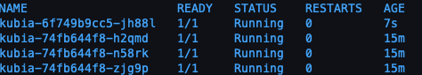

각각 1, 1 일때

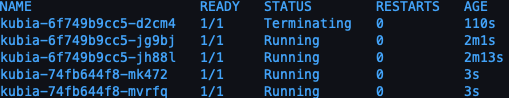

롤아웃 일시정지

```bash
k rollout pause deployment kubia
```

위의 정지 상태가 되면 새파드 하나만 생성되고 중지된다. 이렇게 하면 카나리 릴리즈를 효과적으로 실행할 수 있다. 무슨 말이냐 하면, 잘못된 버전이 롤아웃되서 클라이언트에게 전달되는 것을 최소화 하는 전략이다. 일단 이렇게 포징하면 하나만 생성된 상태에서 체크할 수 있고 롤아웃을 계속 할지 롤백할지 선택할 수 있다.

롤아웃 재개

```bash
k rollout resume deployment kubia
```

잘못된 버전의 롤아웃 방지

minReadySeconds속성은 파드를 사용 가능한 것으로 취급하기 전에 새로 만든 파드를 준비할 시간을 지정한다. 파드가 사용가능할 때까지 롤아웃 프로세스가 계속되지 않는다. 파드가 준비된 후 쿠버네티스가 10초 동안 대기하도록 해 롤아웃 프로세스 속도를 늦출 수 있다. minReadySeconds 가 지나기 전에 새 파드가 제대로 작동하지 않고 레디니스 프로브가 실패하기 시작하면 새 버전의 롤아웃이 효과적으로 차단 된다.

롤아웃 데드라인 설정

롤아웃이 10분동안 진행되지 않으면 실패한 것으로 간주된다.

ProgressDeadlineExceeded 조건이 표시된다.

지금까지 레플리케이션 콘트롤러 , 레플리카 셋, 서비스의 노드포트, 로드발란서, 인그리스등을 따로 학습하고, 서비스 하에 파드 및 컨트롤러 제어를 간편하게 할 수 있는 deployment를 알아봤다.

롤아웃 기능이 왜 필요 한지, 운영상 매우 민감한 이슈인 배포때 뼈저리게 느낄 수 있는데, 수시로 업데이트가 이루어지는 작금의 개발 시대에서는 이러한 부분에 대한 이해는 필수이다.


-  EKS에서 ingress ALB 로드 밸런서 컨트롤러 구축하기
    
    구축하는 방법은 사실 쉽다 그런데 설명은 불친절했다.
    
    [Amazon EKS의 ALB 수신 컨트롤러](https://docs.aws.amazon.com/ko_kr/eks/latest/userguide/alb-ingress.html)
    
    [Amazon EKS cluster IAM role](https://docs.aws.amazon.com/eks/latest/userguide/service_IAM_role.html)
    
    [Setup - AWS ALB Ingress Controller](https://kubernetes-sigs.github.io/aws-alb-ingress-controller/guide/controller/setup/)
    
    클러스터에 IAM OIDC 공급자를 생성하고 클러스터에 연결해야한다. (쉽게 말해 권한을 줘야만 된다)
    
    ```bash
    eksctl utils associate-iam-oidc-provider \\
        --region region-code \\
        --cluster prod \\
        --approve
    ```
    
    정책정보를 다운받아서 내 AWS 에 생성해야한다.
    
    ```bash
    curl -o iam-policy.json <https://raw.githubusercontent.com/kubernetes-sigs/aws-alb-ingress-controller/v1.1.8/docs/examples/iam-policy.json>
    ```
    
    ```bash
    aws iam create-policy \\
        --policy-name ALBIngressControllerIAMPolicy \\
        --policy-document file://iam-policy.json
    ```
    
    생성 후에는 화면에 만들어진 정책의 넘버가 표기 된다. 이를 잘 기록해둬야 한다.
    
    ```bash
    eksctl create iamserviceaccount \\
        --region region-code \\
        --name alb-ingress-controller \\
        --namespace kube-system \\
        --cluster prod \\
        --attach-policy-arn arn:aws:iam::'???':policy/ALBIngressControllerIAMPolicy \\
        --override-existing-serviceaccounts \\
        --approve
    ```
    
    왜냐하면 방금 적은 넘버를 '???' 자리에 입력해야 하므로!
    
    이제 실제로 인그레스를 만드는 작업을 진행할텐데 그전에 미리 해야 할 일이 있다.
    
    ```bash
    eksctl get cluster 생성한 클러스터 명 
    ```
    
    위 명령어를 수행하면 클러스터의 간략한 정보가 나오는데 이때 vpc-id와 subnet은 따로 메모해둔다.
    
    rbac-role도 주입하고
    
    ```bash
    kubectl apply -f <https://raw.githubusercontent.com/kubernetes-sigs/aws-alb-ingress-controller/v1.1.8/docs/examples/rbac-role.yaml>
    ```
    
    ```bash
    kubectl apply -f <https://raw.githubusercontent.com/kubernetes-sigs/aws-alb-ingress-controller/v1.1.8/docs/examples/alb-ingress-controller.yaml>
    ```
    
    위의 원격지 yaml을 바로 실행하고 후에 수정하는 방법과 저 파일을 wget해서 수정해서 apply하든 편하게 하면 되는데 중요한건
    
    ```bash
    spec:
          containers:
          - args:
            - --ingress-class=alb
            - --cluster-name=your cluster name
            - --aws-vpc-id=your vpc-id
            - --aws-region=your region-code
    ```
    
    위의 스펙 명시는 되야 한다는 것이다.
    
    나는 위의 원격지파일을 wget으로 다운받아서 수정후 아래의 수정사항을 반영함.
    
    ```bash
    k apply -f alb-ingress-controller.yaml
    ```
    
    수정 사항을 반영하고, k get pod --all-namespaces 이나, kubectl get pods -n kube-system 같이 하면 인그레스 컨트롤러가 러닝되는걸 확인할 수 있습니다.

### kubectl cheatsheet

[kubectl 치트 시트](https://kubernetes.io/ko/docs/reference/kubectl/cheatsheet/)

-   EKS
    
    eks를 터미널에서 실행하려면 AWS계정에 AMI에서 progrmatic access 계정을 생성하고, 필요한 권한을 설정 해야한다.(생각보다 세부적으로 하려면 권한의 양이 많아서 일단, ADMIN(full access)으로 설정) 나중에는 한번 세부권한에 대해 알아보고 기록해보도록 하겠다.
    
    기본 설치에 대한 링크는 아래에서 확인!
    
    [eksctl 시작하기](https://docs.aws.amazon.com/ko_kr/eks/latest/userguide/getting-started-eksctl.html)
    
    클러스터를 생성하는 명령어
    
    ```bash
    eksctl create cluster --name kubia --version 1.15 --region ap-northeast-2 
    " 잠깐! 이대로 실행하면 과금폭탄의 진행이다. default로는 m5.large 스펙이 기동되기 때문이다." 
    "노드 스펙을 정하기위해 managed-nodegroup을 생성하는 법도 있지만 간단하게 스펙 옵션 값만 조정해도 된다."
    eksctl create cluster --name kubia --version 1.15 --region ap-northeast-2 --node-type t2.micro --nodes 3 --nodes-max 5 
    ```
    
    위와 같이 옵션을 추가해서 실행하면 목표하는 스펙(ex. t2.micro)으로 워커노드를 기동할 수 있다.
    
    기타 명령어 들은 `kubectl` 로 기동하는 부분이니 실습과 다를게 없다. 만약 서버 스펙상 pods가 생성이 안되고 pending 된다고 할때는
    
    ```bash
    eksctl get nodegroup로 노드그룹 명을 조회
    eksctl scale nodegroup --cluster kubia --nodes '원하는 개수' --name '조회한 노드그룹 명'
    " 만약 max-capacity가 늘리려는 노드보다 부족할 경우 --node-max '원하는 최대 노드 수' 를 설정한다." 
    ```
    
    클러스터를 삭제하려면
    
    ```bash
    eksctl delete cluster --name kubia
    ```
    
    등이 있겠다. 이 정도의 선수 지식 이면 일단 aws eks를 터미널에서 시작하는데 불편함은 없을 것이다. 세부적인 설정 변경은 cli상에서 커맨드에 —help 옵션을 입력해서 알아보도록 하자.
    
    추가 사항! gke는 그냥될것 같은데 aws의 EKS는 워커노드로 EC2 인스턴스를 노드 개수만큼 생성한다. 개별적 pod에 ssh접속하려면,
    
    ec2인증서를 등록하거나, 본인 PC 의 ssh 키를 등록해줘야한다. (openssh 로 생성) ./ id\_rsa.key 같은것. 근데 그냥 본인 EC2에 생성한 키페어를 개인적으로는 추천!
    
    그렇게 작성한 커맨드 옵션은 다음과 같다.
    
    ```bash
    eksctl create cluster --name kubia --version 1.15 --region ap-northeast-2 --node-type t2.micro --nodes-max 5 --nodes 4 --ssh-access --ssh-public-key='본인 ec2 인증서 키 이름'
    ```
    
    위와 같이 클러스터 생성 혹은 노드 그룹 생성시 설정해줘야 해당 EC2 인스턴스 생성시 인증서가 포함되고, 나중에 pod에 ssh 접속시 접속이 가능하다!
    
    여러가지 쿠버네티스 환경을 쓸때 전환방법
    
    **컨텍스트 나열**`kubectl config get-contexts` **컨텍스트 전환**`kubectl config set current-contex MY-CONTEXT`

