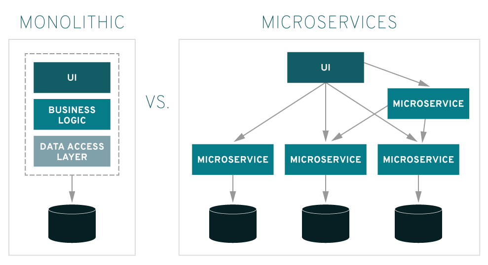

# 마이크로서비스 아키텍쳐란 MSA?

## Microservice

마이크로 서비스 아키텍처 (Micro Service Architecture) 란, 최근에 각광받고 있는 웹 기반 분산 서비스 시스템 아키텍처를 말하며, 이러한 아키텍처를 갖는 서비스 자체를 마이크로 서비스 (Micro Service) 라 한다.

### 마이크로서비스는 다음과 같은 특징을 지니고 있다.

- 마이크로서비스들은 모듈화 개념이다. 마이크로서비스들의 목적은 대규모 소프트웨어 시스템을 작은 부분들로 나누는 것이다. 따라서 이들은 조직과 소프트웨어 시스템의 개발에 영향을 미친다.

- 마이크로서비스는 서로에게 독립적으로 배포할 수 있다. 한 마이크로서비스에 대한 벼경은 다른 마이크로서비스의 변경과는 독립적으로 생산 환경에 적용할 수 있다.

- 마이크로서비스는 서로 다른 기술로 구현될 수 있다. 각각의 마이크로서비스에 대해 프로그래밍 언어나 플랫폼에 관련된 제약은 없다.

- 마이크로서비스는 자체적인 데이터 저장소(개별 데이터베이스 또는 공유된 데이터베이스 내에서 완전하게 분리된 스키마)를 갖는다.

- 마이크로서비스는 검색엔진이나 특정 데이터베이스 같은 해당 서비스를 지원하는 서비스를 가질 수 있다. 물론, 모든 마이크로서비스에 대한 공통적인 플랫폼(예를 들어, 가상 머신)도 있다.

- 마이크로서비스는 독립적인 프로세스나 서비스를 지원하기 위한 가상 머신이다.

- 마이크로서비스는 네트워크를 통해 통신해야 한다. 이를 위해, 마이크로서비스는 REST나 메세징같은 느슨한 결함을 지원하는 프로토콜을 사용한다.

### 왜 마이크로서비스인가~

- 강력한 모듈화

- 쉬운 교체 가능성

- 지속 가능한 개발

- 레거시 애플리케이션의 추가 개발

- 적시 출시

- 독립적인 확장

- 기술의 자유로운 선택

- 지속적인 전달

### 단점

- 숨겨진 관계

- 리팩토링의 어려움

- 도메인 아키텍쳐의 중요성

- 마이크로서비스 실행의 복잡함

- 분산 시스템의 복잡성

### 마이크로서비스의 크기를 결정하는 요소

- 팀의 크기가 상한을 결정한다. 각 팀이 분리된 배포 단위에 대해 작업할때만 가능하다. 반대로 한팀이 여러 마이크로서비스를 작업할 수 있다.

- 더 많은 모듈화는 마이크로서비스의 크기를 제한한다.마이크로서비스는 개발자가 이해하고 더 개발하는 것을 허용하는 크기가 바람직하다.

- 교체가능성은 마이크로서비스의 크기를 감소시킨다.

- 마이크로서비스 크기의 하한은 인프라스트럭처에 의해 설정된다. 마이크로서비스에 필요한 인프라스트럭처를 제공하기 어렵다면 그수를 더 제한해야한다.

- 분산통신은 마이크로서비스의 개수에 따라 증가한다.

- 데이터의 일관성과 트랜잭션은 오직 하나의 마이크로서비스내에서만 보장된다. 따라서 마이크로서비스는 일관성과 트랜잭션에 여러 마이크로서비스가 관련될 수 있을 정도로 너무 작아서는 안 된다.

- 마이크로 서비스는 독립적으로 확장될 수 있는 단위가 보장되는 크기로 선택되야 한다.
