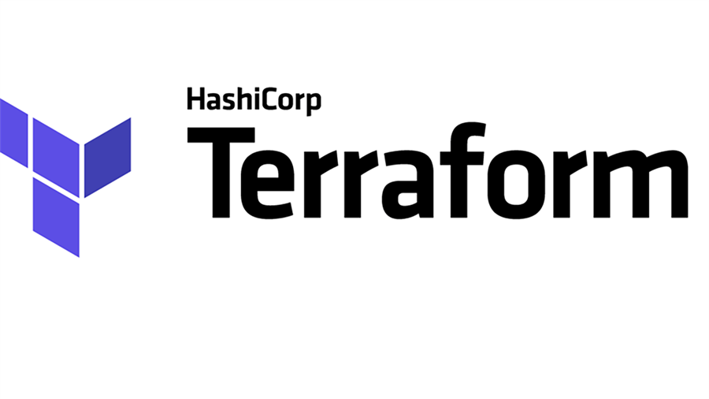
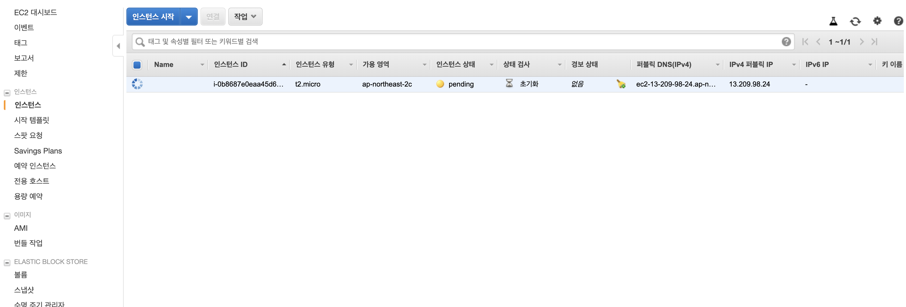

# Terraform

## 테라폼은 무엇인가.

테라폼은 IaC도구중 하나이다. 테라폼은 HashiCorp사에서 개발했고, Go언어로 프로그래밍 되어 있는 오픈 소스 도구이다.
테라폼은 테라폼 바이너리를 통해 코드에 정의된 AWS, Microsoft Azure, Google Cloud, OpenStack등의 공급자가 제공한 API를 통해 호출을 한다. 테라폼은 기본적으로 각 공급자가 제공한 API 서버 리소스를 활용해 인프라를 구성한다는 것을 알 수 있다.

## 테라폼이 다른 코드형 인프라 도구와 다른점은?

- 테라폼은 구성관리를 하는 Ansible, Puppet, Chef, Saltstack 등의 구성도구와 다른 배포도구이다.

- 테라폼은 구성관리 도구와 달리 변경사항이 발생시 새로운 환경을 구성해서 배포하고 이상이 없으면, 이전 구성을 제거한다. 따라서 문제가 발생시 이전 환경으로 재빨리 되돌릴 수 있다.

- 선언형 언어이다. 절차적인 상태의 선언이 아닌 최종적으로 원하는 형태를 선언해서 목적을 달성한다. 이는 코드만 봐서는 크게 차이점을 느낄수 없지만, 동작 방식에서 확연히 차이가 난다.

  > 앤서블의 경우 서버를 10대 돌리고 있다가, 15대로 늘려야 할 경우, 코드에 15라고 쓰면 추가로 15대가 생성돼서, 25대가 되버리므로, 기존의 서버 대수를 파악하고, 5대로 수정해서 실행해야한다. 코드 작성 후 이후에는 상태관리가 이뤄질수 없다는 뜻이다.

  > 테라폼은 이전의 서버 카운트가 10이었다면, 15로 늘리면, 기존의 상태인 10에서 15로 증가해준다. 이는 이전 정보의 상태를 테라폼이 알고 있기 때문이다.

  > 위의 경우는 비단 갯수만이 아닌 다양한 변경사항이 발생할 경우 더욱 빛을 발한다. 서버 이미지의 아이디 변경과 같은 문제 등

  > 코드 자체가 마지막 상태를 나타내므로, 별도의 이력 추적이 필요없으며, 수동으로 현재 상태를 파악할 필요가 없어 작업이 수월해진다.

- 별도의 마스터서버가 필요없음

  > 서버 구성 도구와 달리 각 제공사의 API서버와 통신하므로, 별도의 관리 서버가 필요없다.

- 에이전트도 없음
  > 별도의 에이전트가 필요없어 에이전트를 관리해야 하거나, 에이전트로 인한 문제를 겪을 필요가 없음.

### How It Works

- 기본 코드 개요

  > 요즘 내가 가장 많이 쓰고 있는 클라우드는 AWS이므로, 예시는 AWS로 진행하려고 한다.

  AWS에서 사용하려면 본인 루트 계정에서 IAM 메뉴에가서, 테라폼을 위한 신규 계정을 발행하고, 프로그램 방식 액세스유형으로 계정을 생성 해야한다.

  또한, 원하는 도구들에 대한 FullAccess 권한을 줘야하는것은 필수적이다.

  추가로, 최초 생성시 발행되는 AWS_SECRET_KEY 및 ID는 꼭
  별도로 저장하거나(csv다운로드 지원) 기록해둬야 한다.

- 테라폼은 다음과 같이 설치한다.

```bash
#ubuntu
sudo apt install terraform
#Mac
sudo brew install terraform
```

aws credential은 홈폴더에 .aws/credentials 파일에 별도로 저장하면 된다고 알고 있지만

왜인지 잘 되지 않아서, 우선적으로 진행한 방법은 별도로
**aws.tf** 라는 파일에 키정보 및 리전 정보를 기록해 두었다.
추후에 방법을 확인하고 다시 수정하도록 하겠다.

```terraform
#aws.tf
provider "aws" {
  region     = "ap-northeast-2"
  access_key = "씨크릿 키 ID"
  secret_key = "씨크릿 키"
}
```

```terraform
#main.tf
resource "aws_instance" "example" {
  ami           = "ami-06e7b9c5e0c4dd014"
  instance_type = "t2.micro"
}
```

새로운 폴더 생성 후 다음과 같이 작성을 한다.

그다음 할일은

```bash
#테라폼 이니셜라이징
terraform init

Initializing the backend...

Initializing provider plugins...

The following providers do not have any version constraints in configuration,
so the latest version was installed.

To prevent automatic upgrades to new major versions that may contain breaking
changes, it is recommended to add version = "..." constraints to the
corresponding provider blocks in configuration, with the constraint strings
suggested below.

* provider.aws: version = "~> 2.36"

Terraform has been successfully initialized!

You may now begin working with Terraform. Try running "terraform plan" to see
any changes that are required for your infrastructure. All Terraform commands
should now work.

If you ever set or change modules or backend configuration for Terraform,
rerun this command to reinitialize your working directory. If you forget, other
commands will detect it and remind you to do so if necessary.

```

그렇게 이닛이 무사히 완료 되면, 테스트 해보기 위한 plan명령어를 수행한다.

```bash
#테라폼 플랜
❯ terraform plan

Refreshing Terraform state in-memory prior to plan...
The refreshed state will be used to calculate this plan, but will not be
persisted to local or remote state storage.


------------------------------------------------------------------------

An execution plan has been generated and is shown below.
Resource actions are indicated with the following symbols:
  + create

Terraform will perform the following actions:

  # aws_instance.example will be created
  + resource "aws_instance" "example" {
      + ami                          = "ami-06e7b9c5e0c4dd014"
      + arn                          = (known after apply)
      + associate_public_ip_address  = (known after apply)
      + availability_zone            = (known after apply)
      + cpu_core_count               = (known after apply)
      + cpu_threads_per_core         = (known after apply)
      + get_password_data            = false
      + host_id                      = (known after apply)
      + id                           = (known after apply)
      + instance_state               = (known after apply)
      + instance_type                = "t2.micro"
      + ipv6_address_count           = (known after apply)
      + ipv6_addresses               = (known after apply)
      + key_name                     = (known after apply)
      + network_interface_id         = (known after apply)
      + password_data                = (known after apply)
      + placement_group              = (known after apply)
      + primary_network_interface_id = (known after apply)
      + private_dns                  = (known after apply)
      + private_ip                   = (known after apply)
      + public_dns                   = (known after apply)
      + public_ip                    = (known after apply)
      + security_groups              = (known after apply)
      + source_dest_check            = true
      + subnet_id                    = (known after apply)
      + tenancy                      = (known after apply)
      + volume_tags                  = (known after apply)
      + vpc_security_group_ids       = (known after apply)

      + ebs_block_device {
          + delete_on_termination = (known after apply)
          + device_name           = (known after apply)
          + encrypted             = (known after apply)
          + iops                  = (known after apply)
          + kms_key_id            = (known after apply)
          + snapshot_id           = (known after apply)
          + volume_id             = (known after apply)
          + volume_size           = (known after apply)
          + volume_type           = (known after apply)
        }

      + ephemeral_block_device {
          + device_name  = (known after apply)
          + no_device    = (known after apply)
          + virtual_name = (known after apply)
        }

      + network_interface {
          + delete_on_termination = (known after apply)
          + device_index          = (known after apply)
          + network_interface_id  = (known after apply)
        }

      + root_block_device {
          + delete_on_termination = (known after apply)
          + encrypted             = (known after apply)
          + iops                  = (known after apply)
          + kms_key_id            = (known after apply)
          + volume_id             = (known after apply)
          + volume_size           = (known after apply)
          + volume_type           = (known after apply)
        }
    }

Plan: 1 to add, 0 to change, 0 to destroy.

------------------------------------------------------------------------

Note: You didn't specify an "-out" parameter to save this plan, so Terraform
can't guarantee that exactly these actions will be performed if
"terraform apply" is subsequently run.
```

마지막으로 plan 적용을 위한 apply까지 진행하면
실제로 AWS에 서버가 생성되는걸 볼 수 있다.

```bash
#테라폼 어플라이
❯ terraform apply

An execution plan has been generated and is shown below.
Resource actions are indicated with the following symbols:
  + create

Terraform will perform the following actions:

  # aws_instance.example will be created
  + resource "aws_instance" "example" {
      + ami                          = "ami-06e7b9c5e0c4dd014"
      + arn                          = (known after apply)
      + associate_public_ip_address  = (known after apply)
      + availability_zone            = (known after apply)
      + cpu_core_count               = (known after apply)
      + cpu_threads_per_core         = (known after apply)
      + get_password_data            = false
      + host_id                      = (known after apply)
      + id                           = (known after apply)
      + instance_state               = (known after apply)
      + instance_type                = "t2.micro"
      + ipv6_address_count           = (known after apply)
      + ipv6_addresses               = (known after apply)
      + key_name                     = (known after apply)
      + network_interface_id         = (known after apply)
      + password_data                = (known after apply)
      + placement_group              = (known after apply)
      + primary_network_interface_id = (known after apply)
                 ...  중략   ...
          + kms_key_id            = (known after apply)
          + volume_id             = (known after apply)
          + volume_size           = (known after apply)
          + volume_type           = (known after apply)
        }
    }

Plan: 1 to add, 0 to change, 0 to destroy.

Do you want to perform these actions?
  Terraform will perform the actions described above.
  Only 'yes' will be accepted to approve.

  Enter a value: yes

aws_instance.example: Creating...
aws_instance.example: Still creating... [10s elapsed]
aws_instance.example: Still creating... [20s elapsed]
aws_instance.example: Creation complete after 26s [id=i-0b8687e0eaa45d66a]

Apply complete! Resources: 1 added, 0 changed, 0 destroyed.
```



생성 된걸 눈으로 봤다면, 이제 제거하자.
명령어는 'terraform destroy'
이부분은 화면 및 진행상황은 생략한다.

매우 잘 제거 됐을 것이다.

기본적인 테라폼 구동에 대한 기초 정리는 이쯤에서 마치고, 향후 복합적인 인프라 구성에 대한 글도 작성하려고 한다. 그날이 바로 다음 주가 되길 바라며

오늘은 여기까지!
