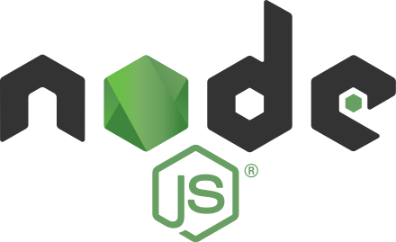

# node.js

## 개인적인 호기심도 있지만, 클라우드 관련 왠만한 튜토리얼이 노드 위주라서 아에 애매하게 하지 말고, 학습을 해보기로 했다.

node.js 학습을 위해 책을 구매 이책을 통해 그동안 등한시한 자바스크립트 지식 보충 및 노드JS 이해도를 높이고,
책의 예시 및 그동안 제작했었던 파이썬 백엔드도 노드로 재구현 해볼까 한다.
제일 좋은건 확장성 있는 앱들을 만들어 보는건데, 아직 생각에만 머무를뿐.. 좀더 고민해 보도록 하겠다.
이 자료는 누군가에게 설명을 하기보다, 개인적인 자료 정리에 가깝다.
뭔가 프로젝트를 하나 해보면 플로우대로 정리한 글을 연재해볼까 한다. 시간이 맞아야 할텐데~

## 노드?

- REPL(Read, Eval, Print, Loop)이란, 리플은 학습도구로서 잘 사용했었는데, 이게 노드에서 제공하는 자바스크립트
  실행 콘솔을 의미한다.
  맨날 자바스크립트 코드 실행은 브라우저에서만 한다고 생각했는데, node에 있었다니 충격적!!! 역시 사람은 배워야한다.
  당연히 실행법은 Node가 설치된 컴퓨터에서 맥은 터미널, 윈도우는 CMD다.

  ```javascript
  node //라고 치면 끝
  >
  > const hello = 'Hello World!';
  undefined
  > console.log(hello);
  Hello World!
  undefined
  >
  ```

  종료는 <kbd>ctrl</kbd>+<kbd>c</kbd> 두번 누르거나, .exit를 입력한다.

- js 파일을 실행하는 법은 마찬가지다. 그냥 node 명령어 뒤에 파일명에서 .js를 빼고 실행하면 된다.
  ```javascript
  //helloworld.js
  function helloWorld() {
    console.log('Hello World')
  }
  helloWorld()
  ```
  위의 자바스크립트 파일을 실행한다.
  ```zsh
  node helloWorld
  ```
- 모듈

  > 2015 자바스크립트에도 import/export라는 모듈 개념이 도입되었다고 한다. 브라우저에서는 크롬 60 버전부터 지원해서 사용가능하다고 한다. 현재 오늘 체크한 버전:78.0.3904.108(공식 빌드) (64비트).

  > 모듈 개념은 파이썬에서는 익숙한데, 자바스크립트를 가볍게 익히는 동안은 다가오지 않았다가 리액트를 접하면서 인지하고, 이번에 노드를 공부하면서 다시 접하게 되었다.

  > 그럼 어떻게 임포트 하는가.

  > 먼저 임포트될 js파일에 선언된 변수나 함수등을 module.exports = 에 여러개의 요소면 객체에 담고, 단일 요소면 함수 혹은 변수명을 넘긴다.

  > 임포트는 require('경로')를 통해 임포트 해온다.

- 노드의 내장객체

  > global은 브라우저의 window와 같다.
  > 각 객체는 node 콘솔에서 global을 입력해보면 출력된다.

  ```
  node
  >global
  ```

  > require등도 global이 생략된 사용이다. console도 마찬가지다.
  > global 객체의 속성에 값을 대입해서 파일간에 데이터를 공유할 수 있지만, 이를 남용하는건 지양해야 한다.

  > console은 우리가 애용하는 console.log등과 같이 똑같다.
  > console.time('이름')/ console.timeEnd('이름')를 통해 시간 측정도 가능하다.
  > console.error() 에러 로그
  > console.trace() 에러 추적
  > console.dir(객체, 옵션) 객체를 콘솔에 표시할 때 사용한다.

  > setTimeout, setImmediate, setInterval
  > 워낙 많이 써서 크게 정리하지 않는다.

  > console.log(**filename);
  > console.log(**dirname);
  > 위와 같이 경로를 확인할때 줄수 있는 옵션 인자가 있다.

  > module.exports는 exports만으로도 사용할 수 있다.
  > 둘 다 같은 객체를 참조하기 때문이다.
  > 단, module.exports에는 어떤값을 대입해도 되지만, exports에는 반드시 속성명과 속성값을 대입해야한다.
  > 즉, exports는 객체만 대입해야 한다.
  > 또한, 한번 exports로 시작했다면 중간에 혼용하는것은 좋지 않다.

  > process
  > 말그대로 node의 프로세스를 관리하는 객체이다.
  > process.version 노드 버전
  > process.arch 아키텍쳐 정보
  > process.platform 운영체제 정보
  > process.pid 프로세스 id
  > process.uptime() 프로세스의 실행누적시간
  > process.execPath 노드의 경로
  > process.cwd() 프로세스가 실행된 경로
  > process.cpuUsage() 프로세스의 CPU사용률

  > process.env 말그대로 시스템 환경변수를 의미한다.
  > 이곳에 노출하고 싶지 않은 SECRET_KEY등을 저장하고 사용할수 있다.

  ```javascript
  const secretId = process.env.SECRET_ID
  ```

  > process.nextTick(callback)
  > 넥스트 틱은 setImmediate나 setTimeout보다 먼저 실행된다. 해당 사항은 마이크로태스크라고 따로 구분지어 부른다.
  > process.exit()
  > 노드 종료

  오늘의 종료는 여기까지 나머지는 내일 이어서 정리하자!! 화이팅!!
