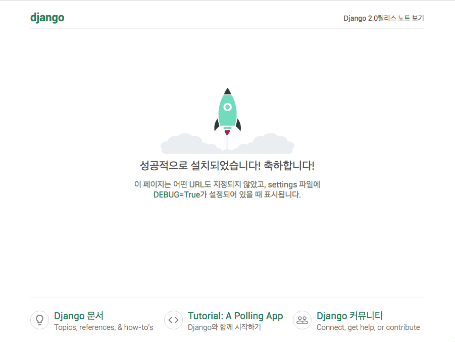

## 지난 6월 2주차 부터 빠른 인원들은 진로를 정하기 시작했다. 무엇을? 프론트엔드할지 백엔드할지

- 그 뒤로 이어진 치열한 파이썬 공부 및 미니터 프로젝트 만들기 진행.

- 1주간의 루이지 데이타 파이프라인 제작 프로젝트 진행 및 발표.

- 그리고 꾸준한 장고의 사용 및 지금은 첫프로젝트의 1주차 4일이 지나고 5일째 아침을 향해가고 있다.

- 그동안 틈틈히 정리해야 했으나, 그러지 못했던 점을 반성하며, 오늘 기억나는 모든 오답노트를 정리하고 소소한 팁도 정리해볼까 한다.

- 정리되는 분위기에 따라 여러글이 될수도 한방글이 될수도 있겠다.

## 장고는?

- 장고는 2003년과 2004년에 로렌스 저널-월드(Lawrence Journal-World)라는 신문사의 인턴 웹 프로그래머였던 에이드리안 홀로바티(Adrian Holovaty)와 사이먼 윌리슨(Simon Willison)이 파이썬을 이용해 애플리케이션을 만들기 시작하면서 처음 개발되었다. 당시 로렌스 저널-월드의 웹사이트는 PHP 기반으로 쓰여졌었는데, 홀로바티와 윌리슨은 PHP는 규모가 큰 웹사이트에 적합하지 않다고 생각했고 이를 계기로 파이썬으로 웹 개발을 하기로 결심했다. 하지만 규모가 큰 웹 개발에 적합한 파이썬 도구가 없다는 것을 깨닫고 그들은 장고를 개발하게 되었다. 장고라는 이름은 홀로바티가 좋아하던 집시 재즈 기타리스트인 장고 라인하르트에서 따온 것이다.

- 사실 장고는 오직 로렌스 웹사이트를 구동하기 위함이었으나, 홀로바티와 윌리슨이 로렌스의 소유자인 더 월드 컴퍼니(The World Company)를 설득하여 오픈 소스로 2005년 7월에 BSD 사용 허가서로 공개하게 되었다.

- 2008년 6월, 장고 소프트웨어 재단이 공식적으로 장고 프로젝트를 관리하게 된다는 공지가 장고 웹사이트에 올라왔다.

- 2017년 12월에 장고 2.0 버전이 출시되었다.[출처-위키]

## 장고를 사용하는 환경설정.

- 현재 최신 버전은 `2.2.3`

- `python3`를 설치해야 한다.

- 장고를 사용하는데 도움되는 환경 프로그램. conda, venv

- conda는 anaconda(데이터 분석 및 머신러닝 모듈 다수 포함), miniconda(필수 최소 설치 버전)

- env환경을 써야하는 이유? 사실 한 컴퓨터에서 하나의 프로젝트만 운영한다면, 쓸필요가 없다.(과거의 나...무식한놈)

- env환경은 오직 파이썬 설치환경만을 고려한다. 모든 패키지를 설치하고 운영해도 괜찮다면 필요 없지만, 분명 고려하지 못한곳에서
  충돌되거나 문제를 일으키지 않는다는 보장은 없다. 그러므로, 프로젝트 마다 고유한 환경이 필요하고, 그때마다 파이썬을 재설치 할건
  아니니까 당연히 프로젝트 별로 가상환경을 쓰는 것은 효율적인 일이다. 그리고 이렇게 습관화 하는 것이 이상적이기도 하다.

- 콘다 기준 가상환경의 관리 법은 다음과 같다.

```python

conda create --name 프로젝트명 python=3.7
# 생성
conda env list
# 리스트보기
conda env remove -n 프로젝트명
# 삭제
conda activate 프로젝트명
# 환경 진입
conda deactivate 프로젝트명
# 환경 종료(나가기)

```

위와 같이 보통 쓰는게 저 정도의 명령어 들 이다.

이제 가상환경을 시작했다면, 마음편하게 필요한 패키지들을 설치하면 된다.

먼저 pip -V를 쳐서 pip 버전 및 pip가 연동된 파이썬 버전을 확인한다.

이상이 없다면, 이제 장고를 시작하기 위해

`pip install django`로 설치한다.

장고가 잘 설치 됐다면, django-admin startproject '프로젝트명'으로 프로젝트를 생성할 수 있다.

보통 프로젝트명의 폴더가 새로 생성되고 프로젝트명을 기반으로 한 폴더 구조가 생성이 완료된다.

만약 현재폴더에 바로 프로젝트 폴더들의 구성이 설치되길 원한다면 '.' 을 추가하면 된다.

```bash
django-admin startproject example
#프로젝트를 생성하는 명령어
django-admin startproject example .
#현재위치에 프로젝트를 구성하는 옵션
```

장고의 파일구성은 최초 생성시 아래와 같다.

```bash
.
├── example  #프로젝트 매인 앱
│   ├── __init__.py #이닛
│   ├── settings.py #프로젝트 설정 파일
│   ├── urls.py # 프로젝트 메인 URL파일
│   └── wsgi.py # 서버구동 파일
└── manage.py #장고 구동 파일
```

이후에 추가되는 앱은 settings.py에 INSTALLED_APPS 안에 기록되어야 장고에서 핸들링 가능하다.
만들고서 최초 구동시의 화면은 다음과 같다.

```bash
Watching for file changes with StatReloader
Performing system checks...

System check identified no issues (0 silenced).

You have 17 unapplied migration(s). Your project may not work properly until you apply the migrations for app(s): admin, auth, contenttypes, sessions.
Run 'python manage.py migrate' to apply them.
#admin 설치를 위한 기본 안내메세지

July 04, 2019 - 22:22:33
Django version 2.2.2, using settings 'example.settings'
Starting development server at http://0.0.0.0:8000/
Quit the server with CONTROL-C.
#이렇게 뜨면 정상 기동이 된것이다.
```

브라우저에서의 화면은 아래와 같다.


다음편에서 계속 됩니다.
