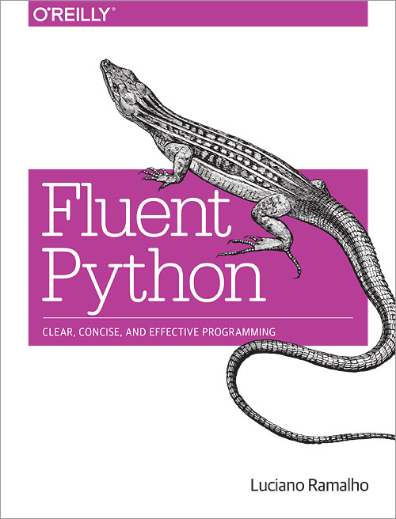

## 전문가를 위한 파이썬 정리하기

## 파이썬 학습 중 보다 한걸음 나아가기 위해 책을 읽고 공부한 부분을 정리하려고 한다.

### 오늘의 정리 내용은 2장 데이터 구조체

- 시퀀스(Sequence)
- 딕셔너리 와 셋트(Dictionary and Set)
- 텍스트와 바이트(Text and Bytes)

### 위 3가지 중 오늘은 시퀀스에 대해 정리한다.(하지만 범위가 넓기 때문에.. 가능한 범위 까지만;;)

파이썬 시퀀스는 가변형과 불변형으로 구분하기도 하지만, 균일 시퀀스와 컨테이너 시퀀스로 분류하는 것도 도움이 된다.

- 가변 시퀀스 (list, bytearray, array.array, collections, deque, memoryview)

- 불변 시퀀스 (tuple, str, bytes)

- 균일시퀀스 (str, bytes, bytearray, memoryview, array.array)

- 컨테이너 시퀀스 (list, tuple, collections, deque)

균일 시퀀스는 작고 빠르고, 사용하기 쉽지만 숫자, 문자, 바이트 처럼 원자적인 데이터만 저장할 수 있다. 

컨테이너 시퀀스는 융통성이 있지만, 가변 객체를 저장할 때는 예상치 못할 일이 발생할 수도 있다. 따라서 내포된 데이터 구조체와 함꼐 컨테이너 시퀀스를 사용할 때는 주의해야한다.

리스트 컴프리헨션 (list comprehension) 과 제너레이터(generator)

리스트 컴프리헨션은 전형적인 파이써닉한 코드 스타일을 보여준다.

```
>>> symbols = '$¢£¥€¤'
>>> codes = []
>>> for symbol in symbols:
...     codes.append(ord(symbol))
...
>>> codes
[36, 162, 163, 165, 8364, 164]
```
==================>

```
>>> symbols = '$¢£¥€¤'
>>> codes = [ord(symbol) for symbol in symbols]
>>> codes
[36, 162, 163, 165, 8364, 164]
```
와 같이 변경 가능하다.

리스트 컴프리헨션은 리스트를 만들어서 추가하는 작업 소요에 굉장히 효과적이다. (적어도 리스트를 생성하는 코드일 경우)

하지만, 뭐든지 남발은 좋지 않다. 두줄이상 넘어갈 경우, for문을 이용해서 하라고 책에서는 권장하고 있지만, 상황에 따라 결정해야 하는게 아닌가 싶다.

하지만 리스트 컴프리헨션은 어디까지나, 리스트를 만드는데만 쓰인다.

다른 종류의 시퀀스를 채우기 위해서는 제너레이터 표현식을 써야한다.

제너레이터는 이책의 후반에서 자세히 다루므로 그떄 정리하도록 한다.

다음 정리는 튜플에서 이어서 할 계획이다. 

See You Later


