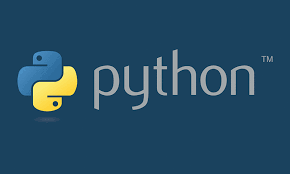

## 파이썬 설치 및 환경 설정하기

**세가지 환경에서 주로 파이썬을 사용중인데, 사실 검색해보면 여러가지 자료가 많으므로, 간략히 정리 해보겠습니다. .**

- `CentOS`, `MacOS`, `Windows` 을 주로 사용중인데, 경험 해보지 않은 설치에 대한 부분은 거론하지 않는다.

- `Windows`의 경우는 개별 설치도 할 수 있지만,[`Anaconda-Python`](https://www.anaconda.com/download/)이 워낙 간편하고, 편리하므로 주로 이것을 사용했다.

- `CentOS`의 경우는 기본으로 설치되는 `python 2.~`버전을 쓴다면 상관없겠지만, 대부분 요즘은 `python 3.~` 버전을 쓰기 때문에, `CentOS` 패키지 관리자인 `yum`에 레포지터리 추가 후 설치하는 방식도 있으나, 버전별 커스텀이 편한 직접 다운로드 설치 방식을 택했다. 예시는 아래와 같다.

```bash

  yum install gcc openssl-devel bzip2-devel

  cd /usr/src
  wget https://www.python.org/ftp/python/3.7.~/Python-3.7.~.tgz

  tar xzf Python-3.x.~.tgz

  cd Python-3.x.~
  ./configure --prefix=/usr/bin
  make && make install

  ln -s /usr/bin/python3.6 /bin/python3
  #python3 로 실행 위한 링크 생성

  curl "https://bootstrap.pypa.io/get-pip.py" -o "get-pip.py"
  python3 get-pip.py
  #pip 설치하기
```

- `MacOS`의 경우 homebrew설치를 통해 간편하게 설치가 가능하다.

  

- homebrew 설치가 안되어 있을때는 [homebrew 설치 페이지 가기](https://brew.sh/index_ko.html)
